# pro-asixc1-g2

# Proposta de CPD

## Ubicació física

El nostre **CPD**, preparat per suportar fins a **8.000 connexions simultànies**, s’ubicarà a la **planta baixa d’una nau industrial**, en una zona interior, **sense finestres** i **protegida de l’exterior**. Aquesta elecció respon a criteris de:

- **Seguretat**
- **Eficiència energètica**
- **Adequació tècnica**

La nau ofereix un espai ampli i robust per integrar sistemes crítics com:

- Refrigeració
- Subministrament elèctric
- Control d’accessos

La ubicació interior, no visible des de l’exterior, redueix riscos físics i ambientals, i facilita el manteniment segur i eficient del CPD.

La nau estarà situada al **Parc Empresarial Granland Badalona Sud (Barcelona)**, amb accés:

- Metro, tramvia i RENFE
- Ronda de Dalt (sortides 25, 26 i 27)
- Accés a Barcelona per Diagonal Mar i Gran Via

<p align="center">
  
</p>

---

## Sistemes de climatització

Fem servir un sistema de **refrigeració natural**, aprofitant l’aire fresc exterior per mantenir:

- Temperatura: **18 °C - 27 °C**
- Humitat relativa: **45% - 55%**

Característiques del sistema:

- Filtres HEPA per a neteja de l’aire
- Circulació interna mitjançant **ventiladors automàtics**
- Regulació per **sensors ambientals**
- Expulsió de l’aire calent per sortides d’extracció
- Distribució de l’aire fred per sota, al costat dels racks

Inclou un sistema de **detecció de fums VESDA** per a major seguretat.


---

## Mesures per dificultar la identificació de la sala

Per evitar la identificació del CPD:

- **Cap rètol visible**
- **Porta d’accés discreta**, similar a la resta
- **Segona porta** interna per accedir als servidors
- **Control biomètric + PIN Pad**
- **Només personal autoritzat** coneix la ubicació exacta

---

## Distribució i gestió del cablejat

Per garantir ordre i seguretat:

- **Separació del cablejat elèctric i de dades**
- Canals independents per evitar interferències
- **Cables de xarxa pel terra tècnic**
- **Cables d’alimentació sota terra tècnic**
- **Etiquetatge i codificació per colors**

<p align="center">
  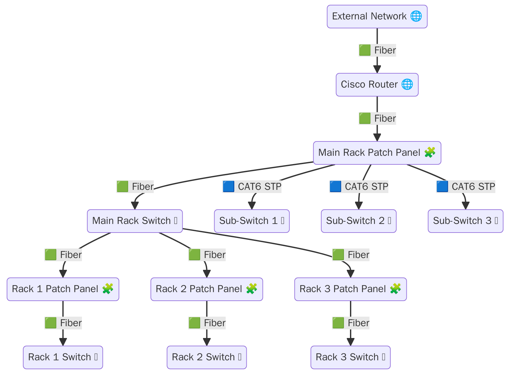
</p>

---

## Terra tècnic i sostre tècnic

Disposem d’un **terra tècnic elevat (50 cm)** que permet:

- Canalització d’aire fred
- Distribució segura del cablejat elèctric
- Accés fàcil per a manteniment

El terra tècnic estarà enfonsat al terra de la nau, amb **reixes i portes d’accés**.

<p align="center">
  
</p>

---


## Esbós de la sala de servidors

Característiques:

- **Quadre elèctric** abans de la sala principal
- **Ordinador de control** del CPD
- **Aire condicionat** de suport
- **SAIs** (1 per rack) per mantenir operativitat en cas de fallada elèctrica

**Dimensions de la sala:** 5m x 4m

<p align="center">
  
</p>

<p align="center">
  
</p>

---


## Estructuració dels racks

Comptem amb **3 racks de 42U**, organitzats en una fila horitzontal:

- **Rack 1:** Servidors i sistemes de virtualització
- **Rack 2:** Emmagatzematge i còpies de seguretat
- **Rack 3:** Comunicacions i xarxa (switches, firewall, etc.)

Cada rack inclou:

- **PDU intel·ligents**
- **Etiquetatge i organització interna**

Aquesta estructura facilita el manteniment, millora l’eficiència energètica i permet escalar la infraestructura segons necessitats.


# Infraestructura IT

Per desenvolupar aquesta proposta, s’han investigat les tendències actuals en hardware per a centres de dades, utilitzant fonts fiables com especificacions de fabricants (Dell, Cisco, Panduit) i estàndards de la indústria. S’han prioritzat components que equilibren rendiment, eficiència energètica i sostenibilitat, considerant les necessitats específiques d’Innovate Tech. La selecció s’ha centrat en hardware compatible amb un entorn híbrid (núvol i local) per maximitzar l’escalabilitat i minimitzar l’impacte ambiental.


## Servidor: Dell PowerEdge R670

**Especificacions tècniques:**
- **Processador:** 2x Intel Xeon Scalable de 4a generació (32 nuclis per CPU, 2.1 GHz)
- **Memòria RAM:** 256 GB DDR5, escalable fins a 8 TB
- **Emmagatzematge:** 4x SSD NVMe de 3.84 TB en RAID 10
- **Eficiencia energètica:** Dell Smart Cooling i OpenManage Power Manager

**Propòsit:**
- Serveis web i transcodificació de vídeo en temps real
- Suport per a àudio i compartició de dades


### Sostenibilitat:

#### ODS 7:
- **Fonts d'alimentació de categoria Titanium:** Eficiència >94%
- **OpenManage Power Manager:** Monitoratge i optimització del consum
- **Dell Smart Cooling:** Reducció de fins a un 20% del consum de refrigeració


#### ODS 12:
- **Disseny modular:** Facilita l’actualització sense substituir tot l’equip
- **Materials reciclables:** Programes com Dell Asset Recovery Services


#### ODS 13:
- **Materials i processos sostenibles:** Alumini reciclat redueix fins a un 95% d’emissions respecte alumini verge

**Justificació:**  
Els PowerEdge R760 són ideals per gestionar entre 8000 i 9500 connexions simultànies amb un rendiment alt, mantenint l’eficiència energètica i escalabilitat modular (ODS 9).

<p align="center">
  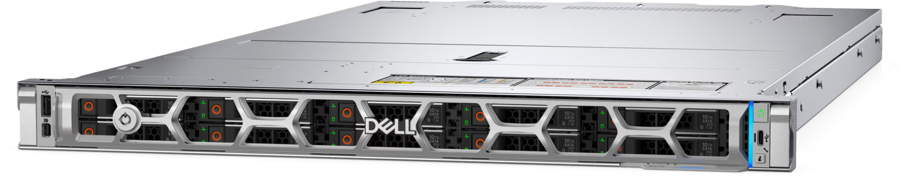
</p> 

<p align="center">
  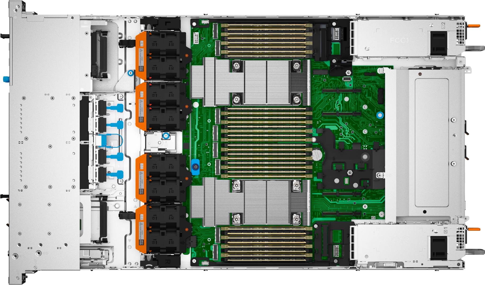
</p> 

---


## Patch Panels: HYCONNECT HPP-94802F

**Especificacions tècniques:**
- **48 ports RJ45 Cat6** (fins a 10 Gbps)
- **Compatibilitat:** Cat6
- **Disseny modular** amb ports numerats

**Propòsit:**
- Organització de connexions de xarxa entre servidors, switches i dispositius auxiliars
- Suport per a streaming 2K de 8000-9500 connexions simultànies (48-57 Gbps)


### Sostenibilitat:

#### ODS 7:
- Component passiu, no consumeix energia

#### ODS 12:
- Disseny modular i materials reciclables (plàstics/metalls reutilitzables)

#### ODS 13:
- Menor extracció de recursos, disseny compacte per eficiència energètica

<p align="center">
  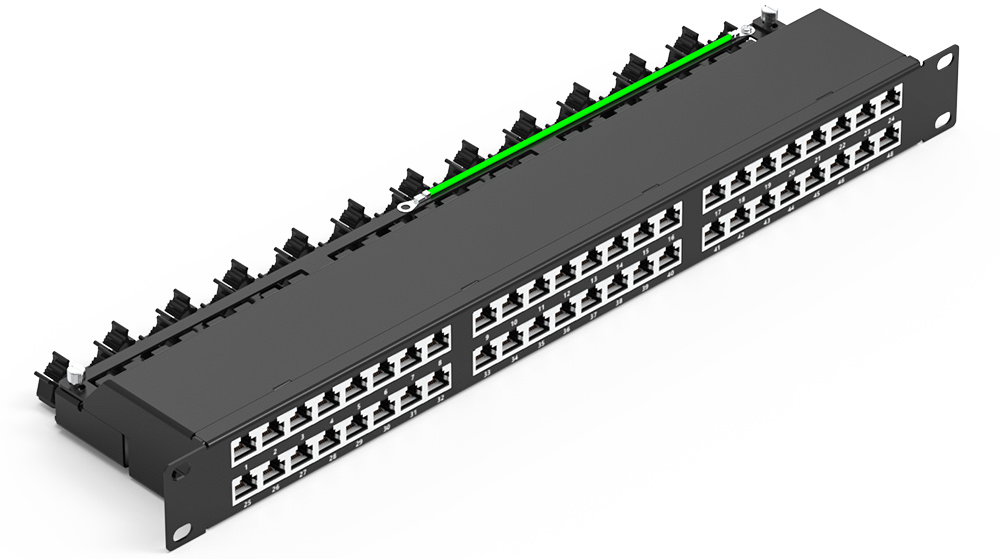
</p> 

---


## Switches: Cisco Nexus 93600CD-GX (2 unitats)

**Especificacions tècniques:**
- **28 ports 100/400GbE QSFP-DD + 8 ports 10/25GbE SFP28**
- **Capacitat total:** 12.8 Tbps
- **Característiques:** VXLAN, EVPN, segmentació de xarxa, Cisco EnergyWise

**Propòsit:**
- Gestió del tràfic de 48-57 Gbps de 8000-9500 connexions simultànies
- Connexió amb núvols (AWS/Google Cloud)
- Latència <1 ms i alta fiabilitat


### Sostenibilitat:

#### ODS 7:
- Fonts d’alimentació d’alta eficiència (92%+)
- Cisco EnergyWise: Reducció fins a un 15% del consum en ports inactius

#### ODS 12:
- Disseny escalable per evitar substitucions
- Materials reciclables i programes de reciclatge

#### ODS 13:
- Fabricació amb menor petjada de carboni

<p align="center">
  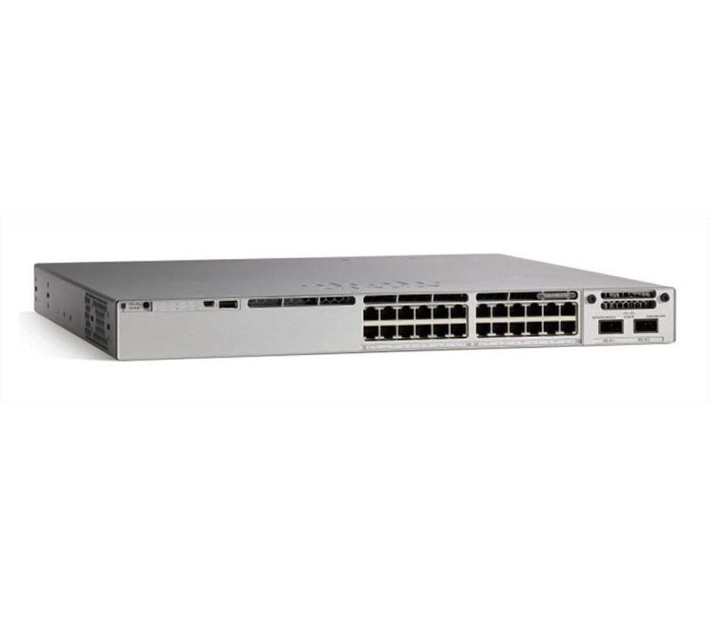
</p> 

---


## Planells i diagrames

### VISTA ESQUEMATICA CPD
<p align="center">
  
</p>

### FUNCIONAMENT PATCH PANEL
<p align="center">
  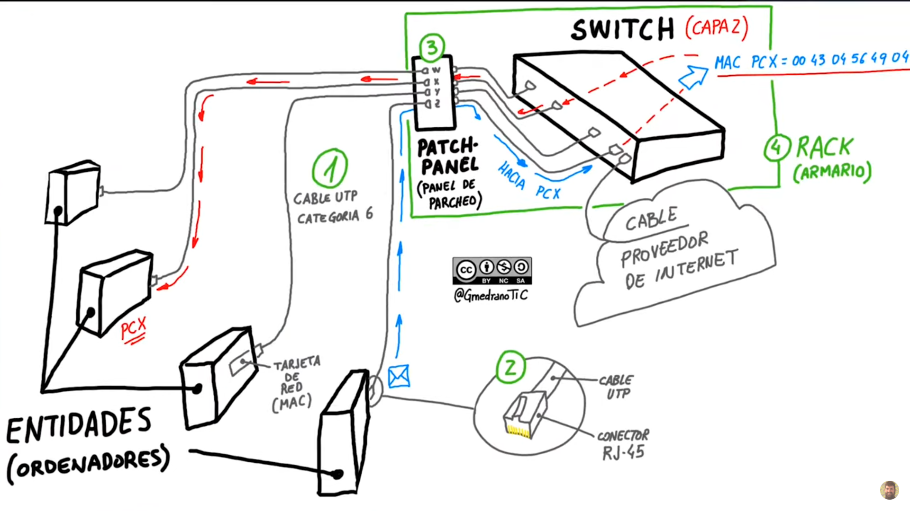
</p>

### ESTRUCTURA DELS SERVIDORS
<p align="center">
  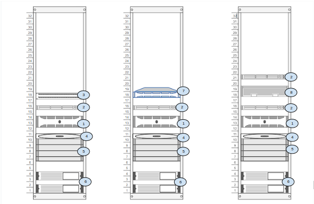
</p>  

**1. SERVER
2. SWITCH
3. PATCH PANEL
4. VENTILADOR
5. PANELES CIEGOS
6. SAI UPS
7. NAS**

#### Plànol de la sala del CPD

<p align="center">
  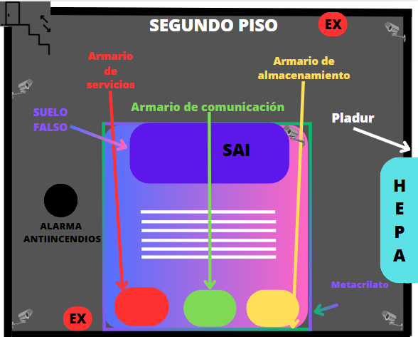
</p> 

#### Diagrama de flux de seguretat
<p align="center">
  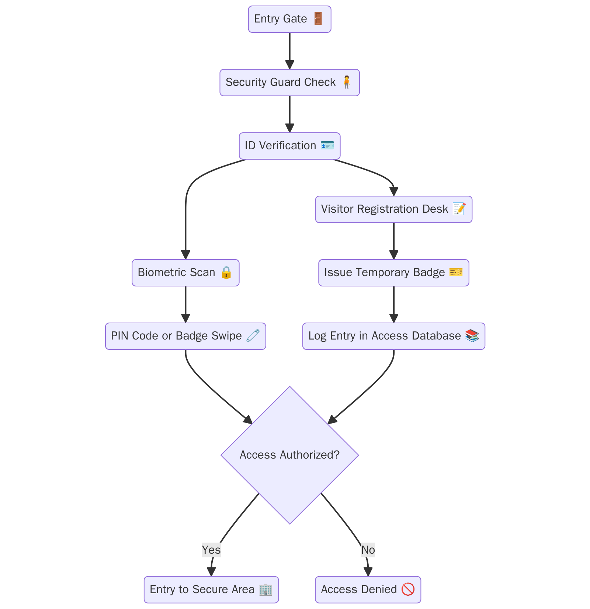
</p> 

#### Diagrama de videovigilància
<p align="center">
  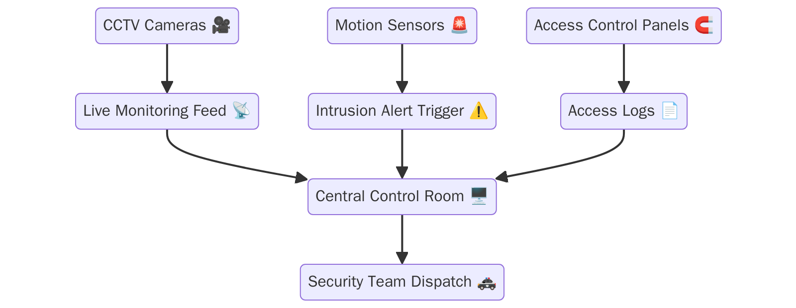
</p> 


#### Diagrama del sistema antiincendis

<p align="center">
  
</p> 

### Fotografies
  - Portes de seguretat amb biometria
<p align="center">
  
</p> 
  - Càmeres instal·lades
<p align="center">
  
</p> 
---


# Estudi d'Autonomia del CPD d'Innovate Tech

## Introducció

Per determinar durant quant de temps podrien funcionar els servidors del Centre de Processament de Dades (CPD) d'Innovate Tech amb la configuració proporcionada, suposant una interrupció del subministrament elèctric i basant-se únicament en un sistema de suport (com ara un SAI o un generador), cal calcular el consum elèctric total dels tres racks i comparar-lo amb la capacitat d’un sistema de suport típic.

La infraestructura inclou:
- 3 servidors **Dell PowerEdge R760**
- 1 switch principal **Cisco Catalyst 9300-24S**
- 4 sub-switches **Cisco Catalyst 9200-48T**
- 1 patch panel **HYCONNECT HPP-94802F**
- 1 router **Cisco ISR 4451**
- 1 router **Cisco RV340**
- 1 NAS **Dell PowerVault ME5024**
- 6 **PDUs APC AP8881** (2 per rack)
- 3 racks de **42U**

---


## Etapa 1: Càlcul del consum elèctric per rack

### Components i consum estimat

- **Servidors Dell PowerEdge R760** (3 unitats):
  - Especificacions: 2x Intel Xeon Scalable 4a Gen, 512 GB DDR5, 8x SSD NVMe 3,84 TB, GPU NVIDIA H100.
  - Consum estimat: **~2 kW** per unitat.

- **NAS Dell PowerVault ME5024**:
  - 24x SSD 3,84 TB, 4x SFP28.
  - Consum estimat: **~0,6 kW**

- **Switch principal Cisco Catalyst 9300-24S**:
  - Consum estimat: **~0,2 kW**

- **Sub-switches Cisco Catalyst 9200-48T** (4 unitats):
  - Consum estimat: **~0,15 kW** per unitat (total: **~0,6 kW**)

- **Router principal Cisco ISR 4451**: **~0,3 kW**

- **Router Cisco RV340**: **~0,05 kW**

- **Patch panel HYCONNECT HPP-94802F**: **0 kW** (component passiu)

- **PDUs APC AP8881**: **~0,1 kW** per rack (2 unitats de 0,05 kW)

- **Ventiladors per rack**: **~0,2 kW** per rack

### Consum total per rack

- **Rack 1 (processament principal i xarxa central):**  
  `2 + 0,2 + 0 + 0,1 + 0,2 = 2,5 kW`

- **Rack 2 (emmagatzematge i processament secundari):**  
  `2 + 0,6 + 0,3 + 0,1 + 0,2 = 3,2 kW`

- **Rack 3 (xarxa d’empleats i processament addicional):**  
  `2 + 0,3 + 0,3 + 0,05 + 0,1 + 0,2 = 2,95 kW`

### Total consum CPD

**2,5 + 3,2 + 2,95 = 8,65 kW (~8650 W)**

---


## Etapa 2: Autonomia amb SAI

### Model de referència: APC Symmetra PX 10 kVA
- **Capacitat efectiva:** ~9 kW (factor potència 0,9)
- **Bateria estàndard:** 30 minuts a plena càrrega
- **Energia disponible:** 9 kW × 0,5 h = **4,5 kWh**
- **Cost estimat:** 10.000–15.000 USD

### Càlcul d’autonomia

- **CPD complet (8,65 kW):**  
  `4,5 ÷ 8,65 ≈ 0,52 h ≈ 31 minuts`

- **Només servidors (6 kW):**  
  `4,5 ÷ 6 ≈ 0,75 h ≈ 45 minuts`

### Amb SAI de 20 kVA (~9 kWh)

- **CPD complet:** `9 ÷ 8,65 ≈ 1,04 h ≈ 62 minuts`
- **Només servidors:** `9 ÷ 6 ≈ 1,5 h ≈ 90 minuts`
- **Cost estimat:** 20.000–30.000 USD

### Generador de suport

- Potència: **10–15 kVA**
- Cost: **~5000–10.000 USD**
- Arrencada: **1–2 minuts**
- Autonomia amb 100 litres de dièsel: **8–10 hores**

---


## Etapa 3: Temps de funcionament estimat

| Escenari                     | Autonomia estimada |
|-----------------------------|---------------------|
| SAI 10 kVA – CPD complet     | ~31 minuts          |
| SAI 10 kVA – Només servidors | ~45 minuts          |
| SAI 20 kVA – CPD complet     | ~62 minuts          |
| SAI 20 kVA – Només servidors | ~90 minuts          |
| Generador dièsel            | 8–10 hores (100L)   |

---


## Consideracions addicionals

- **Càrrega variable:** amb menys connexions (ex. 4000), el consum pot baixar a 4–5 kW, allargant l’autonomia.
- **Ventilació:** apagar ventiladors (estalvi de ~0,6 kW) pot estendre el temps, però amb risc d’escalfament.
- **Bateries:** es degraden amb el temps (~20% menys autonomia als 3–5 anys sense manteniment).

---


## Resum Final

Amb la configuració actual, el CPD consumeix **8,65 kW**. Amb un **SAI de 10 kVA**, el centre podria funcionar **31 minuts**, o **45 minuts si només es mantenen els servidors**. Amb un **SAI de 20 kVA**, s'arribaria fins a **90 minuts**. Per períodes més llargs, un **generador dièsel** pot garantir **8–10 hores** o més, depenent del combustible.

Els **31–33U lliures per rack (138–147 cm)** permeten ampliar la infraestructura amb SAIs o generadors addicionals en el futur.

# Infraestructura Elèctrica

## Sistemes d’Alimentació Redundant

### Doble font d’alimentació externa
- Connexió a **dues línies elèctriques independents** (proveïdor principal i secundari).
- Cada línia connectada a un **quadro elèctric independent** amb **interruptors automàtics** de protecció contra sobrecàrregues i curtcircuits.

### Generador elèctric d’emergència
- **Tipus:** Generador dièsel de **100 kVA**
- **Cobertura:** Servidors, climatització, il·luminació i sistemes de seguretat.
- **Temps d’engegada:** 10-15 segons després de la pèrdua de corrent.
- **Dipòsit:** Autonomia per a **24 hores**, amb **contracte de reposició ràpida**.
- **Ubicació:** Àrea externa ventilada, protegida contra incendis i amb accés restringit.

## Distribució elèctrica interna

- Sistema de distribució amb **busbars** (barres conductores).
- Quadres de distribució amb **circuits segregats**:
  - Servidors (racks)
  - Climatització
  - Sistemes auxiliars
- **Cablejat:** Coure amb aïllament ignífug.
- **Capacitat màxima:** 80 kW

### Redundància N+1
- Per a **tots els components crítics** (transformadors, quadres elèctrics, SAIs).
- **Exemple:** Si es necessiten 2 transformadors, s’instal·len 3.

---


## SAI (Sistema d’Alimentació Ininterrompuda)

### Capacitat i especificacions
- **SAIs modulars**, capacitat total: **80 kVA**
  - 60 kW per servidors
  - 20 kW per climatització i sistemes auxiliars
- **Tecnologia:** Doble conversió online
- **Eficiència energètica:** ≥95% (ODS 7)

### Nombre de bateries

- **Tipus:** 
  - Plom-àcid segellades (VRLA)
  - Bateries de liti (Li-ion)

#### Càlcul de la càrrega
- **Consum estimat:** 80 kW  
- **Temps d’autonomia requerit:** 15 minuts  
- **Energia necessària:**  
  `80 kW × (15/60) h = 20 kWh`

#### Supòsit de bateries
- **Bateria tipus:** 48V, 100 Ah → 4,8 kWh/bateria  
- **Nombre mínim:** `20 kWh ÷ 4.8 = 4.16` → **5 bateries (amb marge)**

#### Configuració
- **2 bancs de bateries en paral·lel (N+1)**:
  - **3 bateries per banc**
  - Permet manteniment sense interrupcions

---


## Components addicionals

- **Mòduls de bypass automàtic**
- **Sistema de monitoratge remot**:
  - Estat de càrrega
  - Temperatura
  - Cicles de vida
  - Alertes en temps real
- **Armaris de bateries**:
  - Ventilació
  - Protecció contra incendis (RIPCI)

---


## Temps de funcionament sense corrent

- **Objectiu:** 15 minuts per servidors i sistemes crítics
- **Escalabilitat:** Possibilitat d’ampliació a 30 minuts afegint més bancs

---


## Sostenibilitat

- Ús de **bateries reciclables** amb **certificació de baix impacte ambiental**
- Configuració del SAI en **mode ECO** en càrregues baixes
- **Gestió responsable del reciclatge** de bateries amb un proveïdor autoritzat

<p align="center">
  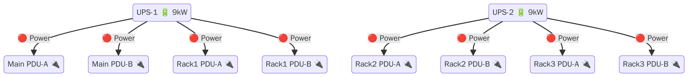
</p> 

# Seguretat Física del CPD

## 1. Elements de Control d’Accés

Per garantir la seguretat del CPD, cal implementar un sistema robust de control d’accés que restringeixi l’entrada només a personal autoritzat.

### Portes de seguretat amb tancament electromagnètic
- Portes blindades amb **tancaments electromagnètics**.
- Resistents a intrusions i amb **protecció contra incendis** (classificació RF-60 o superior).

### Sistemes d’autenticació biomètrica i/o targetes RFID
- **Lectors d’empremtes dactilars** o **escàners d’iris**.
- **Targetes RFID** personalitzades amb codis únics.
- **Doble factor d’autenticació**: combinació de biometria i PIN o targeta.

### Registre d’accessos
- Sistema centralitzat que **enregistra hora, data i identitat** de cada accés o intent.
- Integració amb software de gestió per monitoratge en temps real.

### Sala de control adjacent
- Sala propera amb **personal de seguretat** per verificar autoritzacions.

### Mesures per dificultar la identificació
- **Absència de senyalització externa** sobre el CPD.
- Portes **sense identificadors visuals** i acabats discrets.

---


## 2. Videovigilància

### Càmeres IP d’alta resolució
- Resolució mínima **4K** amb visió nocturna.
- Ubicació: entrades, passadissos, racks i zones perimetrals.
- **Angle de visió de 360°** o càmeres **PTZ**.

### Enregistrament i emmagatzematge
- Gravació contínua **24/7**.
- Emmagatzematge en **servidor dedicat** amb **RAID 5**.
- **Retenció de dades:** 30 dies (complint RGPD).

### Monitoratge en temps real
- Connexió amb **sala de control** per supervisió directa.
- **Alertes automàtiques** en cas de moviment no autoritzat.

### Seguretat del sistema
- **Xifratge de transmissió** de vídeo.
- Accés restringit amb **autenticació de dos factors**.

---


## 3. Sistemes de Prevenció, Detecció i Extinció d’Incendis

### Prevenció
- **Materials ignífugs** per parets, terres i sostres (RF-120).
- **Cablejat ignífug**, ordenat en safates.
- **Control climàtic**:
  - Temperatura: 18–27°C
  - Humitat relativa: 40–60%

### Detecció
- **Sensors de fum i calor** òptics i tèrmics (sostre i sota terra tècnic).
- **Sistemes d’alarma** visuals i sonors connectats al panell central.
- **Monitoratge contínua** via sistema BMS.

### Extinció
- **Gas net**: FM-200 o Novec 1230 (segurs per equips i persones).
- **Extintors manuals** de CO₂ i pols ABC, revisats periòdicament.
- **Tancament automàtic** de portes cortafocs.

---


## 4. Vies d’Evacuació

### Rutes clarament senyalitzades
- **Senyals lluminosos i reflectants** visibles fins i tot amb fum.
- Mínim de **dues sortides independents**, accessibles en menys de 50 m.

### Portes d’emergència
- Amb **barres antipànic**, obertura cap a l’exterior.
- Connexió directa a **escales protegides o zones segures**.

### Il·luminació d’emergència
- **Llums LED** amb bateries independents.
- Autonomia mínima: **2 hores**.

### Simulacres i formació
- **Pla d’evacuació documentat**.
- **Simulacres periòdics**.
- **Cartells informatius** amb plànol de sortida.

---


## 5. Diagrames, Planells i Fotografies

# Seguretat Lògica

## 1. Restricció d’Accés per Autorització

### Control d’accés electrònic
- Instal·lació de **lectors de targeta d’identificació**.
- Només el **personal autoritzat** disposarà de targeta.
- La **persona responsable de la seguretat** haurà d’habilitar la targeta.
- Possibilitat d’**autoritzacions temporals**, també requeriran aprovació explícita.

### Registre d’accés (logs)
- Registre automàtic de:
  - **Hora d’entrada/sortida**
  - **Identitat de la persona**
  - **Motiu de l’accés** (si és possible)
- **Integració** amb sistemes de **control horari** o de **presència**.

---


## 2. Firewalls

### Política per defecte
- **Bloqueig total** inicial: només es permetrà el tràfic explícitament autoritzat.

### Regles per tràfic entrant (extern cap al CPD)
- **HTTP/HTTPS (ports 80 i 443)**:
  - Permetre només connexions cap a **servidors que hostegen plataformes de streaming**.
  
- **Ports de Streaming (RTSP, RTP, etc.)**:
  - Permetre només connexions de **clients autoritzats** (per ex. RTSP 554).

- **Bases de dades**:
  - Permetre tràfic exclusivament entre les **aplicacions de streaming i els servidors de base de dades**:
    - MySQL (3306)
    - PostgreSQL (5432)

- **SSH**:
  - Permetre només a **usuaris de confiança**.

- **Altres serveis**:
  - Permetre només els ports estrictament **necessaris pels serveis futurs**.

---


## 3. Monitorització

### Eines utilitzades
- **Nagios** i **Wireshark** per a monitorització de:
  - Xarxa
  - Bases de dades
  - Web

### Funcionalitats
- Alertes de **caigudes de serveis**.
- Revisió de **logs i esdeveniments**.
- **Anàlisi de dades** i **identificació de tendències** per a millores contínues.

---


## 4. Còpies de Seguretat / Backups

### Estratègia de còpies
- **Còpia completa**:
  - Diumenges a les **23:00** (moment de menor activitat).
  
- **Còpies diferencials**:
  - La resta de dies laborables.

### Tipus d’emmagatzematge
- **Dos tipus diferents**:
  - Discs durs locals
  - Emmagatzematge al núvol

- **Còpia fora de lloc**:
  - Garanteix la **recuperació de dades** en cas de desastre físic al CPD.

---


## 5. RAID (Redundant Array of Independent Disks)

### Configuració recomanada: **RAID 5**

#### Avantatges
- **Alta disponibilitat i redundància**:
  - Mitjançant **paritat distribuïda**, es pot recuperar la informació si un disc falla.

- **Ús eficient de l’espai**:
  - A diferència de RAID 1, no es redueix la capacitat total a la meitat.

- **Bon rendiment de lectura**:
  - Lectura paral·lela gràcies a la distribució de dades entre discos.

- **Cost i escalabilitat**:
  - Bona relació **cost/benefici**.
  - Possibilitat d’**afegir discos** per ampliar la capacitat.

---


# Sostenibilitat

## Optimització del consum d’energia

- Ús d’**energies renovables** i contractació d’**energia verda certificada**.
- Programació de tasques intensives (ex: backups, replicacions) en horaris de **tarifa reduïda**.
- Integració d’**energia solar**.
- Optimització de la distribució elèctrica per evitar conversions innecessàries d’**AC-DC-AC**.
- Implementació de **PDU intel·ligents** per mesurar el consum per rack o dispositiu.
- Automatització de l’activació/desactivació de recursos segons la càrrega.
- Alarmes per detectar **sobreconsum**, ineficiències o calor excessiu.
- Apagat o posada en **mode estalvi** dels equips no essencials fora d’hores punta.
- Ús de servidors, switches i equips amb certificació **Energy Star** o equivalents.

## Ús d’energia verda pel CPD

- Contractació d’un pla d’energia **100% renovable** (solar, eòlica, hidroelèctrica, etc.).
- Empreses d’energia verda recomanades: [Holaluz - Energia verda](https://www.holaluz.com/energia-verde)
- Integració d’energia solar per autoconsum.

## Estalvi en longitud de cablejat

- Organització dels racks i servidors a prop dels **commutadors de xarxa (switches)** i dels quadres elèctrics.
- Ús de càmeres de videovigilància **inalàmbrica** en comptes de cablejades.
- Agrupació dels equips que necessiten connexió entre ells per reduir la necessitat de cables llargs.
- Ús, si és possible, de **racks de comunicacions centrals** per minimitzar la dispersió del cablejat.

## Sistemes de circulació d’aire que aprofitin condicions naturals

- Sistema de ventilació natural que aprofita l’aire exterior quan la temperatura i humitat són adequades.
- L’aire fresc entra filtrat per canals controlats i circula per la sala mitjançant un flux natural, amb suport de ventiladors eficients si cal.
- L’aire calent s’expulsa cap a l’exterior, reduint al mínim el consum d’energia en refrigeració.

## Parada d’equips de comunicacions quan no hi ha càrrega

- Els equips de xarxa i comunicacions es configuren per aturar-se automàticament o reduir l’activitat en absència de trànsit de dades.
- Inclou ports de xarxa, servidors virtualitzats i dispositius redundants, evitant consum innecessari en hores de baixa activitat.

## Equips de baix consum energètic

- Servidors, switches i sistemes d’emmagatzematge seleccionats per la seva eficiència energètica (etiquetes Energy Star o equivalents).
- Aquests equips ofereixen el mateix rendiment amb menor consum elèctric i generen menys calor, reduint la necessitat de refrigeració.


# 🎧 AUDIO – Guia de Configuració del Servidor

---


## 📄 Pàgina 1: Instal·lació de paquets per al servidor d'àudio

**🎯 Objectiu**: Preparar el sistema per al servidor d'àudio amb Icecast2 i eines relacionades.

### 🔧 Passos:

1. **Instal·lació de paquets**:
   ```bash
   sudo apt install icecast2 nginx libnginx-mod-rtmp ffmpeg iperf3 htop -y
   ```
   - **Descripció**: Instal·la `icecast2` (streaming d'àudio), `nginx` i `libnginx-mod-rtmp` (streaming de vídeo), `ffmpeg` (gestió multimèdia), `iperf3` (proves d'amplada de banda) i `htop` (monitorització). L'opció `-y` automatitza la instal·lació.
   - **Acció**: Executar la comanda en un sistema Ubuntu.

2. **Habilitació d'Icecast2**:
   ```bash
   sudo sed -i 's/ENABLE=false/ENABLE=true/' /etc/default/icecast2
   ```
   - **Descripció**: Modifica `/etc/default/icecast2` per habilitar l'inici automàtic d'Icecast2.
   - **Acció**: Executar la comanda per activar el servei.

---


## 📄 Pàgina 2: Configuració del servidor Icecast2

**🎯 Objectiu**: Configurar els paràmetres d'Icecast2 per a connexions d'àudio.

### 🔧 Passos:

1. **Edició de la configuració d'Icecast2**:
   ```xml
   <limits>
     <clients>100</clients>
     <sources>5</sources>
     <queue-size>524288</queue-size>
     <client-timeout>30</client-timeout>
     <header-timeout>15</header-timeout>
   </limits>
   ```
   - **Descripció**: Estableix 100 clients màxims, 5 fonts d'àudio, cua de 524288 bytes, temps d'espera de clients de 30 segons i de capçaleres de 15 segons a `/etc/icecast2/icecast.xml`.
   - **Acció**: Editar el fitxer amb un editor com `nano` i afegir/modificar la secció `<limits>`.

<div align="center">
  
</div>

---


## 📄 Pàgina 3: Configuració del tallafocs i inici de DarkIce

**🎯 Objectiu**: Obrir ports per a Icecast2 i iniciar el streaming amb DarkIce.

### 🔧 Passos:

1. **Obertura de ports al tallafocs**:
   ```bash
   sudo ufw allow 8000/tcp
   sudo ufw allow 22/tcp
   ```
   - **Descripció**: Permet trànsit al port 8000/TCP (Icecast2) i 22/TCP (SSH) amb `ufw`.
   - **Acció**: Executar les comandes per actualitzar les regles del tallafocs.

2. **Inici de DarkIce**:
   ```bash
   sudo darkice
   ```
   - **Descripció**: Inicia DarkIce per enviar fluxos d'àudio a Icecast2 usant `/etc/darkice.cfg`.
   - **Acció**: Executar la comanda per iniciar el streaming.

---


## ▶️ Inici i execució d'Icecast i l'àudio

**🎯 Objectiu**: Executar Icecast i fer la comprovació que funciona l'àudio.

### 🔧 Passos:

1. **Execució de la comanda de transmissió**:
   - **Descripció**: La comanda reprodueix en temps real l'arxiu `live.mp3` i l’envia com a streaming d’àudio MP3 a un servidor Icecast a través d'internet.

<div align="center">
  
</div>

2. **Posar a la URL la ruta necessària**:
   ```bash
   http://LA_IP_CORRESPONENT:8000
   ```

3. **Si hem fet tot bé, hauria de sortir la pàgina d'Icecast:**

<div align="center">
  
</div>

4. **Per escoltar l'àudio en directe, afegim `/stream` a la URL**:
   ```bash
   http://LA_IP_CORRESPONENT:8000/stream
   ```

<div align="center">
  
</div>

---


## 📄 Pàgina 4: Actualització del sistema

**🎯 Objectiu**: Actualitzar el sistema per assegurar la versió més recent dels paquets.

### 🔧 Passos:

1. **Actualització de paquets**:
   ```bash
   sudo apt update && sudo apt upgrade
   ```
   - **Descripció**: Actualitza la llista de paquets (`apt update`) i instal·la les versions més recents (`apt upgrade`) des dels repositoris d'Ubuntu.
   - **Acció**: Executar la comanda per mantenir el sistema actualitzat.

---


# 📹 VÍDEO – Configuració del servidor de streaming

---


## 📄 Pàgina 5: Configuració del servidor de streaming de vídeo

**🎯 Objectiu**: Configurar Nginx per a streaming de vídeo en directe i sota demanda.

### 🔧 Passos:

1. **Creació del directori per a vídeos**:
   ```bash
   sudo mkdir -p /var/www/html/videos
   ```
   - **Descripció**: Crea el directori `/var/www/html/videos` per emmagatzemar vídeos sota demanda.
   - **Acció**: Executar la comanda per crear el directori.

2. **Assignació de permisos**:
   ```bash
   sudo chmod -R 755 /var/www/html/videos
   ```
   - **Descripció**: Assigna permisos 755 al directori `/var/www/html/videos`.
   - **Acció**: Executar la comanda per configurar els permisos.

3. **Configuració de Nginx RTMP**:
   ```nginx
   rtmp {
       server {
           listen 1935;
           chunk_size 4096;

           application live {
               live on;
               record off;
           }

           application vod {
               play /var/www/html/videos;
           }
       }
   }
   ```
   - **Descripció**: Configura Nginx per a streaming RTMP al port 1935, amb suport per a streaming en directe (`live`) i sota demanda (`vod`) des de `/var/www/html/videos`.
   - **Acció**: Afegir aquesta configuració al fitxer de Nginx i reiniciar el servei.

---


## ▶️ Execució i comprovació del vídeo

**🎯 Objectiu**: Executar RTMP i comprovar que funciona el vídeo.

### 🔧 Passos:

1. **Execució de la comanda de transmissió**:

- **Descripció**: Aquesta comanda de `ffmpeg` serveix per enviar un vídeo MP4 com a stream en directe cap a un servidor RTMP.

<div align="center">
  
</div>

2. **Obrir un flux de xarxa al VLC**:

- **Descripció**: Aquest pas serveix per reproduir en VLC un vídeo en directe emès per RTMP. Hem de posar la URL per obrir el flux de xarxa (ex: `rtmp://<IP_DEL_SERVIDOR>/live`).

<div align="center">
  
</div>

3. **Visualització del vídeo**:

- **Descripció**: Si ho hem fet tot bé, hauria d'aparèixer el vídeo en qüestió. També es pot fer a l'inrevés: primer obrir el flux de xarxa i després executar la comanda de transmissió.
- **Nota**: Pot ser que hàgim de clicar el botó de PLAY uns quants cops, ja que a vegades triga una mica a començar.

<div align="center">
  
</div>

---


# COMPROVACIÓ D'AMPLE DE BANDA

## Pàgina 7: Instal·lació d'iperf3

**Objectiu**: Instal·lar iperf3 per a proves d'amplada de banda.

**Passos**:
1. **Instal·lació d'iperf3**:
   ```bash
   sudo apt update && sudo apt install -y iperf3
   ```
   - **Descripció**: Actualitza els repositoris i instal·la iperf3. L'output indica que iperf3 ja està a la versió més recent.
   - **Acció**: Executar la comanda per assegurar que iperf3 està instal·lat.

2. **Per assegurar que funcioni, hem de configurar els ports del security group de l'instància**

<div align="center">
  
</div>


## Pàgina 8: Prova d'amplada de banda amb iperf3

**Objectiu**: Mesurar l'amplada de banda de la xarxa.

**Passos**:
1. **Prova amb iperf3 -s**:
   ```bash
   iperf3 -s
   ```
   - **Descripció**:Aquesta comanda inicia iperf3 en mode servidor, deixant la màquina a l’espera de connexions entrants d’un client iperf3.
     
   - **Acció**: Executar la comanda i analitzar els resultats per verificar la capacitat de la xarxa.

<div align="center">
  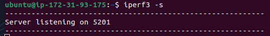
</div>

2. **Prova amb iperf3 -c**:
   ```bash
   iperf3 -c 44.220.106.60
   ```
   - **Descripció**: Executa iperf3 en mode client per connectar-se al servidor 44.202.106.60 (port 5201). Els resultats mostren una transferència de 1.14 GBytes a 977 Mbits/s de mitjana en 10.04 segons.
     
   - **Acció**: Executar la comanda i analitzar els resultats per verificar la capacitat de la xarxa.
   
<div align="center">
  
</div>


---


# **EC21**

## **SERVEI WEB**

### **Instal·lació**

Instal·lar amb:

```bash
sudo apt install nginx
```
<div align="center">
  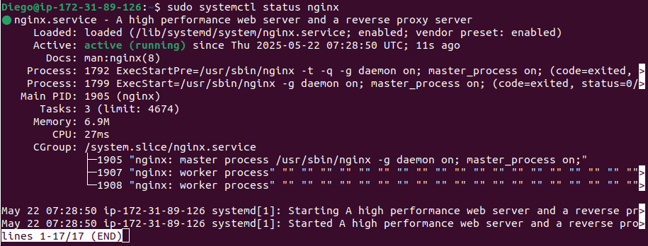
</div>

---


### **Configuració**

Editem l’arxiu de configuració perquè sàpiga on està l'HTML i per on escoltarà.  
També activem el site i ja tindríem operativa la pàgina web.

<div align="center">
  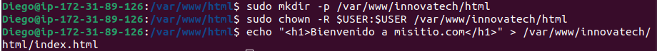
</div>

<div align="center">
  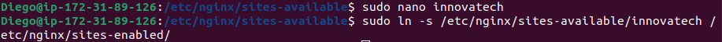
</div>

<div align="center">
  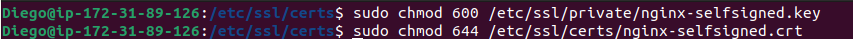
</div>

<div align="center">
  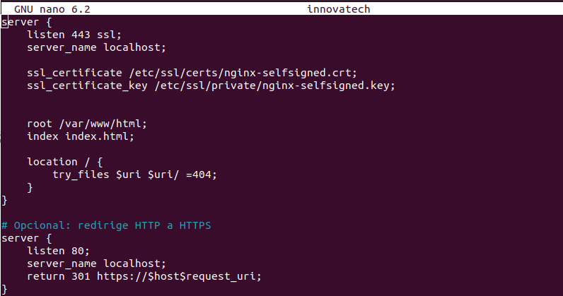
</div>

---


### **Comprovació**

<div align="center">
  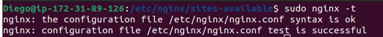
</div>

<div align="center">
  
</div>

---


## **SERVEI FTP**

Instal·lem el servei FTP:

```bash
sudo apt install proftpd -y
```
Al directori li donem només permisos de lectura ja que l'ftp només serà per llegir fitxers d’anuncis de l’empresa, per descarregar coses que publiquem o descarregar arxius importants.

<div align="center">
  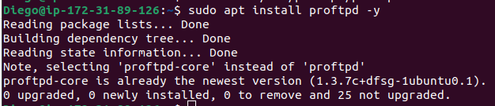
</div>

<div align="center">
  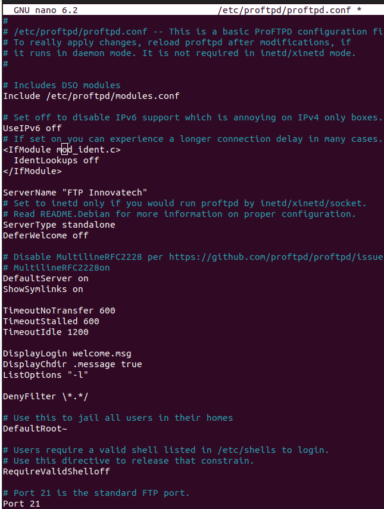
</div>

<div align="center">
  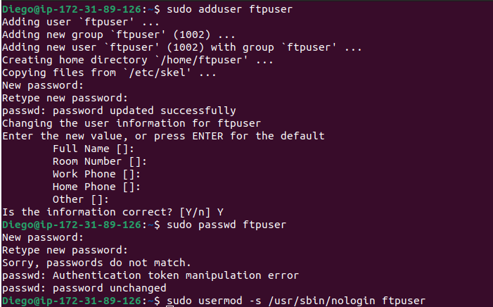
</div>

<div align="center">
  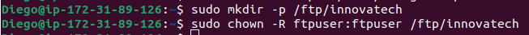
</div>

<div align="center">
  
</div>

<div align="center">
  
</div>


---


## **SERVEI SAMBA**
Com a l’ftp no poden pujar coses ni fer canvis, tenim el samba que és pels usuaris tinguin un “núvol”.

Per instal·lar:

```bash
sudo apt install samba -y
```
Crearem una carpeta on engabiarem als usuaris per només poder tenir accés a aquell directori i subdirectori i a l'arxiu indiquem que directori

<div align="center">
  
</div>

<div align="center">
  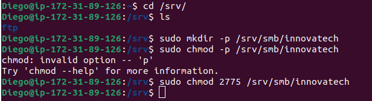
</div>

<div align="center">
  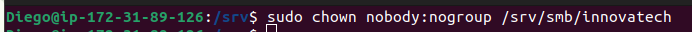
</div>

<div align="center">
  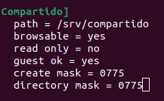
</div>

<div align="center">
  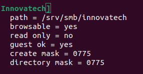
</div>

---


## **EXTRA: CONTROL DE CANVIS PER DISCORD**

### **Instal·lació de dependències**

<div align="center">
  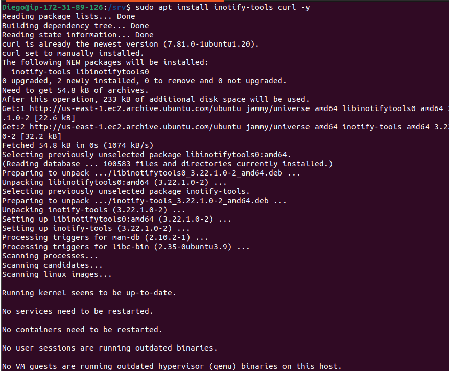
</div>

<div align="center">
  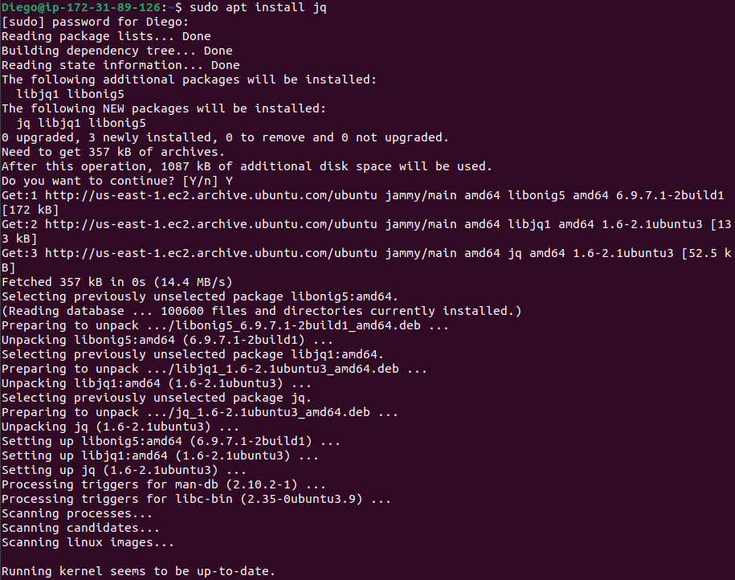
</div>

### **Configuració i comprovació**
Configurem un script per que escolti el que esta pasant al samba indicant la carpeta, i el fem un servei perquè s’executi constantment.

<div align="center">
  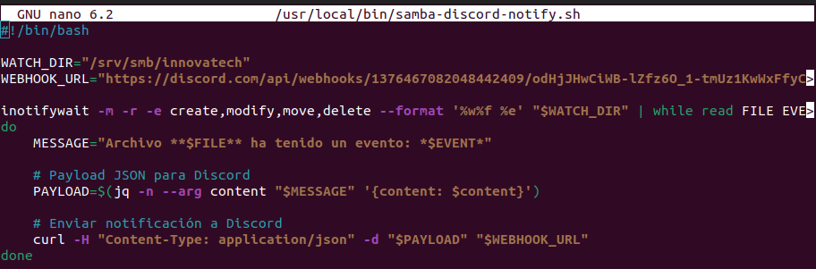
</div>

<div align="center">
  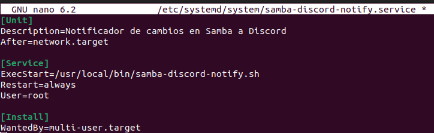
</div>

<div align="center">
  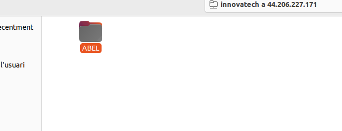
</div>

<div align="center">
  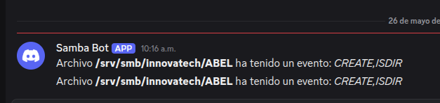
</div>

<div align="center">
  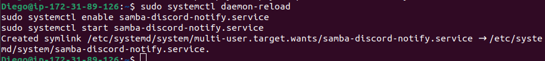
</div>


# **EC21-2:**

## **FAIL2BAN:**


---
Manual de Configuració de Fail2Ban per a Nginx
==============================================

Introducció
-----------

Aquest manual descriu com configurar **Fail2Ban** en un servidor Ubuntu per protegir un servidor **Nginx** (IP: `172.31.204.78`) contra atacs **DDoS** i **SQL Injection**. Fail2Ban monitoritza els logs d'accés de Nginx, bloqueja IPs malicioses i envia notificacions a un webhook de Discord indicant el tipus d'atac detectat.

Requisits
---------

-   Servidor Ubuntu amb Nginx instal·lat.
-   Accés amb permisos de `sudo`.
-   Logs de Nginx a `/var/log/nginx/access.log`.
-   Webhook de Discord per a notificacions.

Instal·lació de Fail2Ban
------------------------

1.  Actualitza el sistema i instal·la Fail2Ban:

    ```
    sudo apt update && sudo apt upgrade -y
    sudo apt install fail2ban -y
    ```

2.  Inicia i habilita el servei:

    ```
    sudo systemctl start fail2ban
    sudo systemctl enable fail2ban
    sudo systemctl status fail2ban
    ```

Configuració de Fail2Ban
-------------------------

### 1. Configurar Filtres

Es van crear dos filtres per detectar atacs específics als logs de Nginx.

#### Filtre per a DDoS (`nginx-ddos`)

1.  Crea el filtre:

    ```
    sudo nano /etc/fail2ban/filter.d/nginx-ddos.conf
    ```

2.  Contingut:

    ```
    [Definition]
    failregex = ^<HOST> -.*"(GET|POST|HEAD).*HTTP.*$
    ignoreregex =
    ```

    - Detecta sol·licituds HTTP repetitives (GET, POST, HEAD) que indiquen un possible atac DDoS.

#### Filtre per a SQL Injection (`nginx-sql-injection`)

1.  Crea el filtre:

    ```
    sudo nano /etc/fail2ban/filter.d/nginx-sql-injection.conf
    ```

2.  Contingut:

    ```
    [Definition]
    failregex = ^<HOST> -.*"(GET|POST).*(union|select|insert|delete|drop|1=1|--|\'|").*HTTP.*$
    ignoreregex =
    ```

    - Detecta sol·licituds HTTP amb paraules clau pròpies d'injecció SQL (per exemple, `union`, `select`, `1=1`).

3.  Prova els filtres amb els logs de Nginx:

    ```
    sudo fail2ban-regex /var/log/nginx/access.log /etc/fail2ban/filter.d/nginx-ddos.conf
    sudo fail2ban-regex /var/log/nginx/access.log /etc/fail2ban/filter.d/nginx-sql-injection.conf
    ```

### 2. Configurar Jails

Els jails defineixen com Fail2Ban respon als atacs detectats.

1.  Edita el fitxer de jails:

    ```
    sudo nano /etc/fail2ban/jail.local
    ```

2.  Contingut:

    ```
    [DEFAULT]
    bantime = 3600
    findtime = 600
    maxretry = 5
    action = %(action_)s
             discord-notify

    [nginx-ddos]
    enabled = true
    port = http,https
    filter = nginx-ddos
    logpath = /var/log/nginx/access.log
    maxretry = 100
    bantime = 3600
    findtime = 60
    action = %(action_)s
             discord-notify

    [nginx-sql-injection]
    enabled = true
    port = http,https
    filter = nginx-sql-injection
    logpath = /var/log/nginx/access.log
    maxretry = 3
    bantime = 86400
    findtime = 600
    action = %(action_)s
             discord-notify
    ```

    - **Paràmetres**:
        - `bantime`: Duració del bloqueig (3600 segons = 1 hora, 86400 segons = 24 hores).
        - `findtime`: Finestra de temps per comptar intents (600 segons = 10 minuts, 60 segons = 1 minut).
        - `maxretry`: Nombre màxim d’intents abans de bloquejar (100 per DDoS, 3 per SQL Injection).
        - `logpath`: Ruta al log de Nginx.
        - `action`: Utilitza l'acció predeterminada (`%(action_)s`) i la notificació a Discord.

### 3. Configurar Notificacions a Discord

S'ha creat una acció personalitzada per enviar notificacions a Discord, indicant si el bloqueig és per DDoS o SQL Injection.

#### Crear l'Script de Notificació

1.  Crea l’script:

    ```
    sudo nano /etc/fail2ban/action.d/discord-notify.sh
    ```

2.  Contingut:

    ```bash
    #!/bin/bash
    WEBHOOK_URL="https://discord.com/api/webhooks/1376445623745904701/eaCwi_8-cdpul8g-iGpTGj5yo9o-7mGkJhfE4J7eKbbuCNyMVOWfiEwJJCg5-c8axAoP"
    IP=$1
    JAIL=$2
    if [[ "$JAIL" == "nginx-ddos" ]]; then
        ATTACK_TYPE="DDoS"
    elif [[ "$JAIL" == "nginx-sql-injection" ]]; then
        ATTACK_TYPE="Injecció SQL"
    else
        ATTACK_TYPE="Desconegut"
    fi
    MESSAGE="Alerta de Fail2Ban: La IP $IP ha estat bloquejada per un atac de tipus $ATTACK_TYPE pel jail $JAIL a $(hostname) el $(date)"
    curl -X POST -H "Content-Type: application/json"\
         -d "{\"content\": \"$MESSAGE\"}"\
         $WEBHOOK_URL
    ```

    - **Explicació**:
        - Determina el tipus d’atac (`DDoS` o `SQL Injection`) segons el jail.
        - Envia un missatge al webhook de Discord amb la IP bloquejada, tipus d’atac, nom del jail, hostname i data.

3.  Dona permisos d'execució:

    ```
    sudo chmod +x /etc/fail2ban/action.d/discord-notify.sh
    ```

#### Crear l’Acció de Fail2Ban

1.  Crea el fitxer d'acció:

    ```
    sudo nano /etc/fail2ban/action.d/discord-notify.conf
    ```

2.  Contingut:

    ```
    [Definition]
    actionstart =
    actionstop =
    actioncheck =
    actionban = /etc/fail2ban/action.d/discord-notify.sh <ip> <name>
    actionunban =
    ```

    - Utilitza `<ip>` i `<name>` per passar la IP bloquejada i el nom del jail a l’script.

### 4. Resolució d’Errors

Durant la configuració es va trobar aquest error:

```
ERROR: Failed during configuration: Bad value substitution: option 'actionban' in section 'Definition' contains an interpolation key 'ip'...

```

**Causa**: Ús incorrecte de `%(ip)s` i `%(jail)s` a `discord-notify.conf`.

**Solució**:

- Substituir `%(ip)s` i `%(jail)s` per `<ip>` i `<name>` a `discord-notify.conf`, utilitzant la sintaxi nativa de Fail2Ban.
- Provar la configuració:

    ```
    sudo fail2ban-client -t
    ```

- Reiniciar Fail2Ban:

    ```
    sudo systemctl restart fail2ban
    ```

### 5. Proves

#### Provar la Detecció de DDoS

1.  Simula un atac DDoS enviant múltiples sol·licituds HTTP:

    ```
    for i in {1..150}; do curl -s http://172.31.204.100/; done
    ```

2.  Verifica el bloqueig.

3.  Desbloqueja la IP:

    ```
    sudo fail2ban-client unban <TEST_IP>
    ```


## DUCKDNS ON PREMISE

S'ha configurat **DuckDNS** al `crontab` perquè s'actualitzi constantment la IP pública de la instància al portal web de DuckDNS.  
Aquesta configuració garanteix que, cada vegada que s'encén la màquina, no es perdi l'associació del DNS dinàmic amb la nova IP, mantenint així la resolució de noms funcional en tot moment.


<div align="center">
  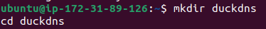
</div>

<div align="center">
  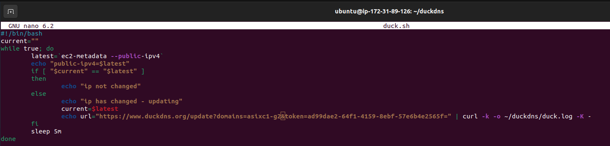
</div>

<div align="center">
  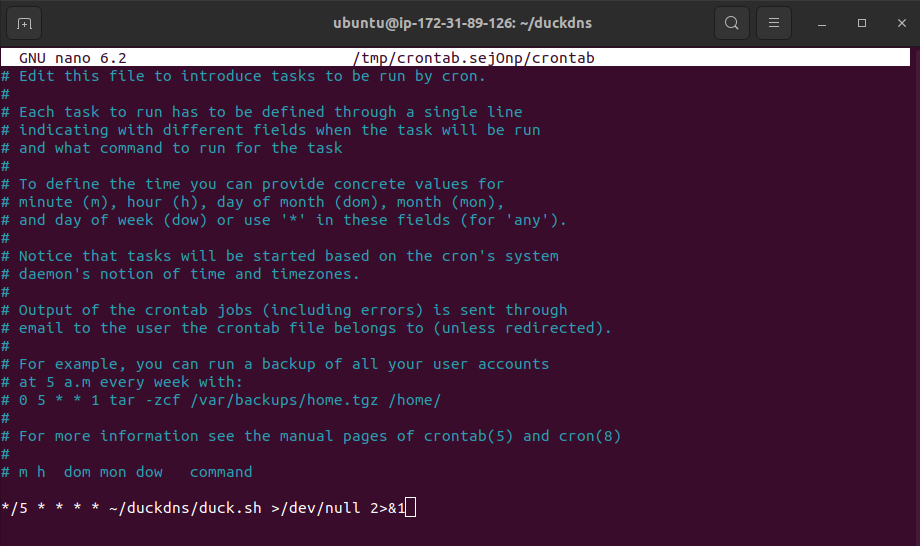
</div>


---


# **EC22:**

## **BASE DE DADES:**

* **Empleats**:  
  * Identificador: DNI.  
  * Atributs: Nom, cognoms, adreça, telèfon.  
  
* **Departaments**:  
  * Identificador: Codi.  
  * Atributs: Nom complet del departament, telèfon.  
  
* **Grup-nivell**:  
  * Identificador: Codi (ex. A1, B1, etc.).  
  * Atributs: Salari total, període de prova, dies de vacances.  
  
* **Conveni**:  
  * S'ha de basar en el **conveni col·lectiu de Consultoria, Tecnologies de la Informació i Estudis de Mercat i de l'Opinió Pública**, àrea 2.  
  * Utilitzar la **taula salarial actualitzada de 2024** per als salaris, períodes de prova i vacances.  
  * Incloure un empleat per cada grup i nivell de l'àrea 2 del conveni.  
  
* **Implementació**:  
  * Disseny entitat-relació (E-R).  
  * Transformació a model relacional.  
  * Implementació en un SGBD (MySQL/MariaDB o AWS RDS).  
  * Introducció d'un nombre significatiu de dades.

### 

### **1. Disseny Entitat-Relació (E-R)**

#### **Entitats i Relacions**

* **Entitat: Empleat**  
  * Atributs: DNI (clau primària), Nom, Cognoms, Adreça, Telèfon.  
  
  * Relacions:  
  
    * Pertany a un **Departament** (relació N:1).  
    
    * Assignat a un **Grup-Nivell** (relació N:1).  
    
* **Entitat: Departament**  

  * Atributs: Codi (clau primària), Nom, Telèfon.  
  
  * Relacions:  
  
* **Entitat: Grup-Nivell**  
  * Atributs: Codi (clau primària), Salari Total, Període de Prova, Dies de Vacances.  
  * Relacions:  
    * Assignat a **Empleats** (relació 1:N).

#### **Diagrama E-R:**

[Empleat\] \-- N:1 \--\> \[Departament\]  
   |                    Atributs:  
   |                    \- Codi (PK)  
   |                    \- Nom  
   |                    \- Telèfon  
   |  
   Atributs:  
   \- DNI (PK)  
   \- Nom  
   \- Cognoms  
   \- Adreça  
   \- Telèfon  
   |  
   |  
   N:1 \--\> \[Grup-Nivell\]  
             Atributs:  
             \- Codi (PK)  
             \- Salari Total  
             \- Període de Prova  
             \- Dies de Vacances 
             
<div align="center"\></div\>

**Pas 1: Connexió al servidor MariaDB/MySQL**

```bash
mysql \-h 172.31.42.193 \-u web\_user \-p
```
---


<div align="center"\></div\>

**Pas 2: Crear la base de dades i seleccionar-la**

```sql
CREATE DATABASE inovatech_db;  
 USE innovatech_db;
```
---


<div align="center"\></div\>

**Pas 3: Crear la taula Departament**

```sql
CREATE TABLE Departament (  
 Codi INT PRIMARY KEY,  
 Nom VARCHAR(50) NOT NULL,  
 Telefon VARCHAR(15)  
 );
```
---


<div align="center"\></div\>

**Pas 3: Crear la taula Grup_Nivell**

```sql
CREATE TABLE Grup_Nivell (  
 Codi INT PRIMARY KEY,  
 Salari\_Total DECIMAL(10,2) NOT NULL,  
 Periode\_Prova INT,  
 Dies\_Vacances INT  
 );
```

---


<div align="center"\><div\>

**Pas 3: Crear la taula Empleat amb claus foranes**

```sql
CREATE TABLE Empleat (  
 DNI VARCHAR(9) PRIMARY KEY,  
 Nom VARCHAR(50) NOT NULL,  
 Cognoms VARCHAR(100) NOT NULL,  
 Adreca VARCHAR(100),  
 Telefon VARCHAR(15),  
 Codi\_Departament INT,  
 Codi\_Grup\_Nivell INT,  
 FOREIGN KEY (Codi\_Departament) REFERENCES Departament(Codi),  
 FOREIGN KEY (Codi\_Grup\_Nivell) REFERENCES Grup\_Nivell(Codi)  
 );
```
---

<div align="center"\> \</div\>

**Pas 4: Inserir dades a la taula Departament**

```sql
INSERT INTO Departament (Codi, Nom, Telefon) VALUES  
 (1, 'Recursos Humans', '934123456'),  
 (2, 'Informàtica', '934123457'),  
 (3, 'Màrqueting', '934123458');
```

---


<div align="center"\></div\>


**Pas 4: Inserir dades a la taula Grup_Nivell**

```sql
INSERT INTO Grup_Nivell (Codi, Salari\_Total, Periode\_Prova, Dies\_Vacances) VALUES  
 (1, 30000.00, 90, 30),  
 (2, 45000.00, 60, 25),  
 (3, 60000.00, 30, 20);
```

---


<div align="center"\></div\>

**Pas 4: Inserir dades a la taula Empleat**

```sql
INSERT INTO Empleat (DNI, Nom, Cognoms, Adreca, Telefon, Codi\_Departament, Codi\_Grup\_Nivell) VALUES  
 ('12345678A', 'Joan', 'García Pérez', 'Carrer Major 1, Barcelona', '600123456', 1, 1),  
 ('87654321B', 'Maria', 'López Martínez', 'Avinguda Diagonal 2, Barcelona', '600123457', 2, 2),  
 ('45678912C', 'Pere', 'Sánchez Gómez', 'Plaça Catalunya 3, Barcelona', '600123458', 3, 3);

```

---


<div align="center"\> \</div\>

**Pas 5: Comprovació dels departaments**

```sql
SELECT \* FROM Departament;

```

---


<div align="center"\></div\>

**Pas 6: Comprovació dels grups-nivell**

```sql
SELECT \* FROM Grup_Nivell;

```

---


<div align="center"\></div\>

**Pas 7: Consultar empleats amb departaments i salaris**

```sql
SELECT e.DNI, e.Nom, e.Cognoms, d.Nom AS Departament, g.Salari\_Total  
 FROM Empleat e  
 JOIN Departament d ON e.Codi\_Departament \= d.Codi  
 JOIN Grup\_Nivell g ON e.Codi\_Grup\_Nivell \= g.Codi;

```

---


<div align="center"\></div\>

**Pas 8: Fer còpia de seguretat de la base de dades**
```bash
mysqldump \-h 172.31.42.193 \-u web\_user \-p empresa \> empresa\_backup.sql
```

---


 <div align="center"\></div\>

**Pas 9: Restaurar la base de dades (si cal)**
```bash
mysql \-h 172.31.42.193 \-u web\_user \-p empresa \< empresa\_backup.sql
```
---


<div align="center"\></div\>


**Pas108 (opcional): Consultes addicionals per verificació**

Altres consultes SQL útils per comprovacions més específiques.


---


<div align="center"\></div\>

**Consulta filtrada: Empleats del departament 2**

```sql
SELECT Nom, Cognoms FROM Empleat WHERE Codi\_Departament \= 2;

```

---


<div align="center"\> \</div\>

**Consulta filtrada: Empleats amb salari 40000**


```sql
SELECT Nom, Cognoms FROM Empleat  
 JOIN Grup\_Nivell ON Empleat.Codi\_Grup\_Nivell \= Grup\_Nivell.Codi  
 WHERE Salari\_Total \> 40000;
```


**Investigar i comparar eficiència energètica amb altres proveïdors del núvol. Com els diferents proveïdors ofereixen solucions de CPD administrats per aquestes empreses i com donen cobertura als requeriments exposats anteriorment.**


**Els principals proveïdors del núvol (Google Cloud, Microsoft Azure i AWS) estan molt compromesos amb la sostenibilitat i l’eficiència energètica dels seus Centres de Processament de Dades (CPD).**


**Tots utilitzen CPDs propis i gestionats, amb certificacions que garanteixen la bona gestió energètica i ambiental.**


* **Google Cloud** destaca per tenir un PUE molt baix (\~1.10) i funciona amb energia 100% renovable des de fa anys, amb l’objectiu d’operar sense emissions les 24 hores el 2030.


* **Microsoft Azure** també aposta per la renovabilitat total abans del 2025 i vol ser “carbon negative” el 2030\.


* **AWS** està avançant cap al 100% renovable el 2025 i manté un PUE lleugerament superior (\~1.14).


* **OVHcloud** ofereix una opció molt eficient amb un PUE excel·lent (\~1.09) i refrigeració per aire lliure, especialment pensada per al mercat europeu.

---


**IP ELASTICA**  

**Per assignar una ip elastica hem d’anar a xarxa i seguretat i clicar a direccions ip elastiques.**

<div align="center">
  
</div>

**Després hem de clicar a ASSIGNAR DIRECCION IP ELASTICA per crear una ip per assignar.**

<div align="center">
  
</div>

**Cliquem a assignar**

<div align="center">
  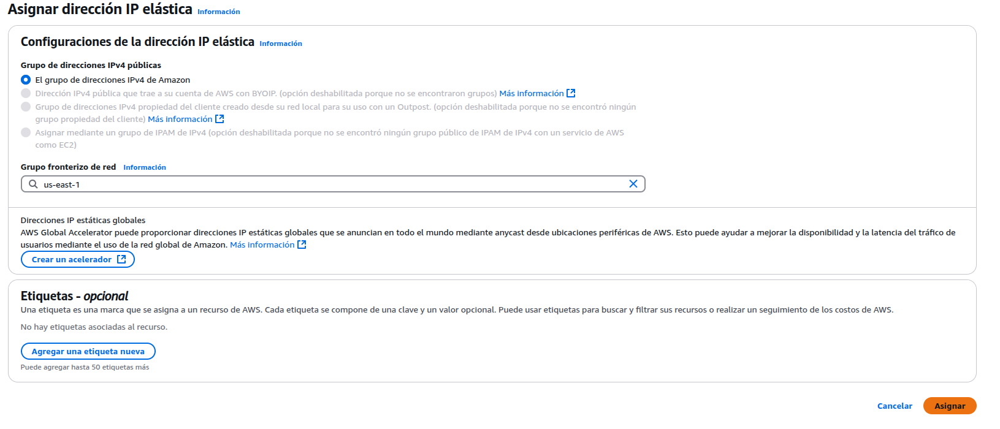
</div>

**I ja tindrem una ip elastica, ara només falta assignar-la a l’instancia adequada**

<div align="center">
  
</div>

**Cliquem a l’IP i despres a DIrecció IP elastica associada.**

<div align="center">
  
</div>

**Aqui, el que farem es assignar l’IP elastica a l’instancia que pertoca, en aquest cas posem l’instancia EC23**

<div align="center">
  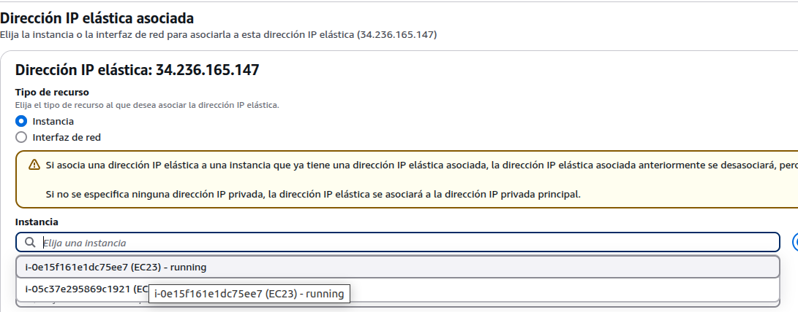
</div>

**Després posem l’IP privada que té la instància** 

<div align="center">
  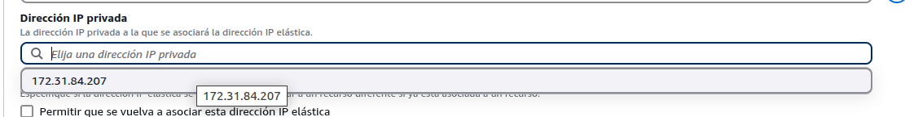
</div>

**I cliquem a associar**

<div align="center">
  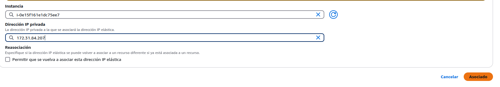
</div>

**Per comprovar que ha funcionat hem d’anar a Instàncies i clicar a la instància a la qual hem assignat l’IP, i podrem comprovar que ja l’hem assignat.**

<div align="center">
  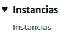
</div>

<div align="center">
  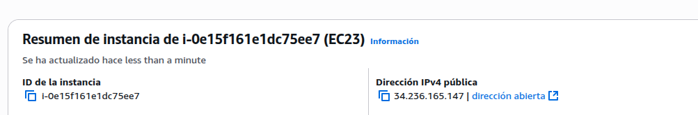
</div>

---


# Disseny i implementació d’una base de dades

## Es tracta de dissenyar i implementar una base de dades per la gestió del personal de l’empresa. Els requisits que es demanen són els següents:


Els empleats s’identifiquen pel seu DNI. A més hem d’enregistrar el nom, cognoms, adreça i telèfon.  
Aquest empleats estan assignats a un determinat departament. Els departaments s’identifiquen amb un codi i també guardarem el nom complert del departament i el telèfon.


Cada empleat té assignat un grup-nivell. Un grup-nivell s’identifica per un codi (A1, B1, etc.) i també enregistrarem el salari total, el període de prova i els dies de vacances.


Cal tenir en compte que a la vostra base dades hi ha un empleat/da de cada grup i nivell de l’àrea 2 del conveni “Consultoria, tecnologies de la informació i estudis de mercat i de l’opinió pública”. Com sabeu, aquest és un dels convenis que més s’apliquen en el vostre sector. D’aquests empleats \-mirant el conveni-, heu de posar el salari total, el període de prova i les vacances.


Es demana fer el disseny entitat-relació, la transformació a relacional i la implementació en un Sistema Gestor de Bases de Dades (MySQL, Oracle, etc.) amb la introducció d’un nombre significatiu de dades.


**Mesures aplicades en matèria de prevenció de riscos laborals en un Centre de Processament de Dades (CPD)**

Els CPD són instal·lacions crítiques que allotgen servidors i equips informàtics essencials per a empreses, i presenten riscos específics com incendis, descàrregues elèctriques, caigudes o problemes ergonòmics. Aquest informe recull les principals mesures preventives implementades per garantir la seguretat dels treballadors, basant-me en normatives com la Llei 31/1995 de Prevenció de Riscos Laborals i en pràctiques habituals del sector.

---


**1. Identificació dels riscos en un CPD**

Abans d’aplicar mesures, és clau identificar els riscos més comuns en un CPD:

* **Riscos elèctrics**: Contacte amb cables, sobrecàrregues o curtcircuits.  
* **Incendis**: Deguts a la gran quantitat d’equips elèctrics i la càrrega tèrmica.  
* **Riscos físics**: Caigudes per cables mal col·locats, lesions per aixecar equips pesants o sorolls elevats dels sistemes de refrigeració.  
* **Riscos ergonòmics**: Males postures en tasques de manteniment o monitors mal ajustats.  
* **Riscos ambientals**: Temperatures extremes per sistemes de climatització o exposició a gasos en cas de fuites.


**2. Mesures preventives aplicades**

Per abordar aquests riscos, s’han implementat les següents mesures, agrupades per categories:


**2.1. Prevenció de riscos elèctrics**

* **Instal·lacions certificades**: Tots els sistemes elèctrics compleixen la normativa del Reglament Electrotècnic de Baixa Tensió. Es fan revisions periòdiques per detectar anomalies.
   
* **Proteccions**: Interruptors diferencials i magnetotèrmics en quadres elèctrics per evitar descàrregues.  
* **Formació**: Els tècnics reben formació específica sobre seguretat elèctrica, incloent l’ús de guants aïllants i eines certificades.  
* **Senyalització**: Zones d’alta tensió marcades amb cartells de perill i accés restringit.


**2.2. Prevenció d’incendis**

* **Sistemes de detecció**: Detectors de fum i calor instal·lats en tot el CPD, connectats a una central d’alarmes.  
* **Extinció automàtica**: Sistemes d’extinció amb gas inert (com FM-200) que no danya els equips i és segur per als treballadors. També hi ha extintors de CO₂ a mà.
  
* **Materials ignífugs**: Cables i revestiments amb certificació de resistència al foc.  
* **Simulacres**: Es fan simulacres anuals per entrenar el personal en evacuacions i ús d’extintors.


**2.3. Prevenció de riscos físics**

* **Ordre i neteja**: Els cables estan canalitzats en safates elevades per evitar ensopegades. El terra és antilliscant i lliure d’obstacles.
  
* **Manipulació de càrregues**: S’usen carros elevadors o plataformes per moure servidors pesants, i es forma el personal en tècniques d’aixecament segur.
  
* **Control de soroll**: Els treballadors que operen prop de sistemes de refrigeració usen protectors auditius quan el nivell de decibels supera els 85 dB.
  
* **Il·luminació**: Llums LED amb intensitat adequada per evitar fatiga visual, especialment en tasques de manteniment.


**2.4. Prevenció de riscos ergonòmics**

* **Estacions de treball**: Monitors i teclats ajustables per mantenir postures neutres. Es proporcionen cadires ergonòmiques per a tasques administratives al CPD.
   
* **Pausos**: S’estableixen descansos cada dues hores per a tècnics que fan tasques repetitives, com la instal·lació de cablejat.  
* **Formació**: Sessions sobre ergonomia per conscienciar sobre postures correctes i ajustos dels equips.


**2.5. Prevenció de riscos ambientals**

* **Climatització**: Sistemes de refrigeració redundants mantenen la temperatura entre 18-24 ºC i la humitat al 40-60%, evitant cops de calor o molèsties.

    
* **Ventilació**: Filtres d’aire per reduir partícules i garantir la qualitat de l’aire.  
* **Control de gasos**: Sensors de CO₂ i protocols per detectar fuites en sistemes de refrigeració.

---


**3. Organització i formació**

* **Pla de prevenció**: El CPD té un pla de prevenció de riscos laborals actualitzat, amb avaluacions periòdiques dels llocs de treball.  
* **Formació contínua**: Els treballadors reben cursos anuals sobre RRLL, incloent primers auxilis, evacuació i ús d’equips de protecció individual (EPI).
  
* **EPI**: Es proporcionen guants aïllants, calçat de seguretat, ulleres protectores i protectors auditius segons la tasca.  
* **Comitè de seguretat**: Un comitè de salut laboral revisa incidents i proposa millores.
  

**4. Integració amb el projecte InnovateTech**

En el context del nostre projecte InnovateTech, aquestes mesures s’han aplicat al CPD d’EC22 (ip-172-31-21-192). Per exemple:

* Hem assegurat que la base de dades innovat\_db i els servidors estiguin en un entorn segur, amb detectors d’incendis i climatització adequada.

  
* Els tècnics que accedeixen al CPD per manteniment (e.g., backups a /backups i S3) usen EPI i segueixen protocols d’ordre.  
* Hem compartit aquestes pràctiques amb el meu company per resoldre el seu problema de connexió, ja que un entorn segur facilita tasques com l’accés a empleats.php en EC21.


---


# Anàlisi del Conveni Laboral: Salaris, Períodes de Prova i Vacances per Grup-Nivell

## 1. Salaris per Grup-Nivell

La taula **Grups_Nivell** recull la remuneració bruta anual, indicada a la columna *Salari Total*, associada a cada categoria professional definida pel seu codi de grup.

A continuació es detallen els salaris corresponents a cada grup-nivell, que reflecteixen la compensació econòmica assignada segons la responsabilitat i experiència esperada:

<div align="center">

<table style="width:60%; font-size:1.1em; border-collapse: collapse;" border="1" cellpadding="8">
  <thead style="background-color:#f2f2f2;">
    <tr>
      <th>Grup-Nivell</th>
      <th>Salari Total Anual (€)</th>
    </tr>
  </thead>
  <tbody>
    <tr><td align="center">A1</td><td align="right">50.000,00 €</td></tr>
    <tr><td align="center">A2</td><td align="right">45.000,00 €</td></tr>
    <tr><td align="center">B1</td><td align="right">38.000,00 €</td></tr>
    <tr><td align="center">B2</td><td align="right">34.000,00 €</td></tr>
    <tr><td align="center">C1</td><td align="right">28.000,00 €</td></tr>
    <tr><td align="center">C2</td><td align="right">24.000,00 €</td></tr>
  </tbody>
</table>

</div>

---


## 2. Períodes de Prova per als Treballadors

El període de prova és el temps durant el qual l’empresa pot avaluar la capacitat i adaptació del treballador al lloc de feina abans de formalitzar definitivament la contractació. Aquest període està definit per la columna *Periode Prova* a la taula **Grups_Nivell** i varia segons la categoria professional.

Els períodes de prova assignats per grup-nivell són:

<div align="center">

<table style="width:60%; font-size:1.1em; border-collapse: collapse;" border="1" cellpadding="8">
  <thead style="background-color:#f2f2f2;">
    <tr>
      <th>Grup-Nivell</th>
      <th>Durada del Període de Prova</th>
    </tr>
  </thead>
  <tbody>
    <tr><td align="center">A1</td><td align="center">6 mesos</td></tr>
    <tr><td align="center">A2</td><td align="center">6 mesos</td></tr>
    <tr><td align="center">B1</td><td align="center">4 mesos</td></tr>
    <tr><td align="center">B2</td><td align="center">4 mesos</td></tr>
    <tr><td align="center">C1</td><td align="center">3 mesos</td></tr>
    <tr><td align="center">C2</td><td align="center">3 mesos</td></tr>
  </tbody>
</table>

</div>


---


## 3. Vacances Assignades pel Conveni

Les vacances anuals constitueixen un dret essencial per al descans i la recuperació del treballador. Segons el conveni, el nombre de dies de vacances es determina en funció del grup-nivell del treballador, reflectit a la columna *Dies Vacances* de la taula **Grups_Nivell**.

Els dies de vacances anuals assignats a cada categoria són:

<div align="center">

<table style="width:60%; font-size:1.1em; border-collapse: collapse;" border="1" cellpadding="8">
  <thead style="background-color:#f2f2f2;">
    <tr>
      <th>Grup-Nivell</th>
      <th>Dies de Vacances Anuals</th>
    </tr>
  </thead>
  <tbody>
    <tr><td align="center">A1</td><td align="center">30 dies</td></tr>
    <tr><td align="center">A2</td><td align="center">28 dies</td></tr>
    <tr><td align="center">B1</td><td align="center">26 dies</td></tr>
    <tr><td align="center">B2</td><td align="center">25 dies</td></tr>
    <tr><td align="center">C1</td><td align="center">23 dies</td></tr>
    <tr><td align="center">C2</td><td align="center">22 dies</td></tr>
  </tbody>
</table>

</div>

---
