# pro-asixc1-g2

# Proposta de CPD

## Ubicació física

El nostre **CPD**, preparat per suportar fins a **8.000 connexions simultànies**, s’ubicarà a la **planta baixa d’una nau industrial**, en una zona interior, **sense finestres** i **protegida de l’exterior**. Aquesta elecció respon a criteris de:

- **Seguretat**
- **Eficiència energètica**
- **Adequació tècnica**

La nau ofereix un espai ampli i robust per integrar sistemes crítics com:

- Refrigeració
- Subministrament elèctric
- Control d’accessos

La ubicació interior, no visible des de l’exterior, redueix riscos físics i ambientals, i facilita el manteniment segur i eficient del CPD.

La nau estarà situada al **Parc Empresarial Granland Badalona Sud (Barcelona)**, amb accés:

- Metro, tramvia i RENFE
- Ronda de Dalt (sortides 25, 26 i 27)
- Accés a Barcelona per Diagonal Mar i Gran Via

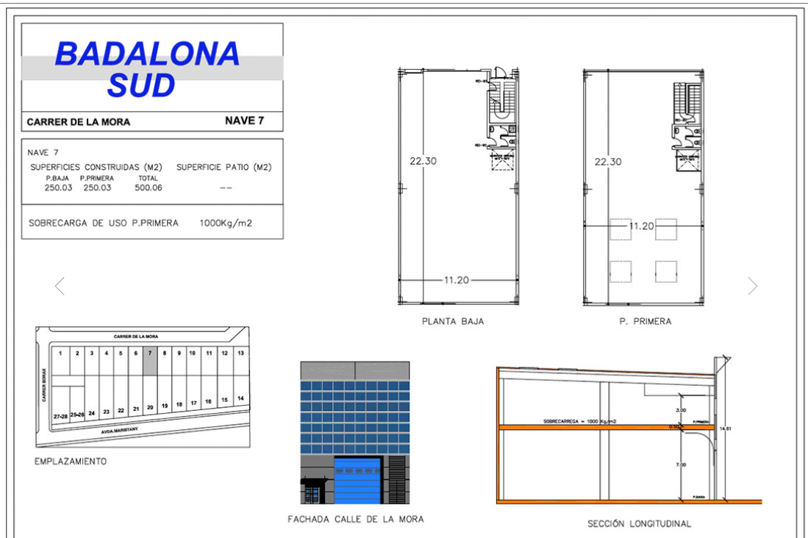


---

## Sistemes de climatització

Fem servir un sistema de **refrigeració natural**, aprofitant l’aire fresc exterior per mantenir:

- Temperatura: **18 °C - 27 °C**
- Humitat relativa: **45% - 55%**

Característiques del sistema:

- Filtres HEPA per a neteja de l’aire
- Circulació interna mitjançant **ventiladors automàtics**
- Regulació per **sensors ambientals**
- Expulsió de l’aire calent per sortides d’extracció
- Distribució de l’aire fred per sota, al costat dels racks

Inclou un sistema de **detecció de fums VESDA** per a major seguretat.

📷 **[Veure esquema del sistema de refrigeració](URL)**

---

## Mesures per dificultar la identificació de la sala

Per evitar la identificació del CPD:

- **Cap rètol visible**
- **Porta d’accés discreta**, similar a la resta
- **Segona porta** interna per accedir als servidors
- **Control biomètric + PIN Pad**
- **Només personal autoritzat** coneix la ubicació exacta

📷 **[Veure imatge de la porta i sistemes de seguretat](URL)**

---

## Distribució i gestió del cablejat

Per garantir ordre i seguretat:

- **Separació del cablejat elèctric i de dades**
- Canals independents per evitar interferències
- **Cables de xarxa pel terra tècnic**
- **Cables d’alimentació sota terra tècnic**
- **Etiquetatge i codificació per colors**

📷 **[Veure esquema de distribució de cablejat](URL)**

---

## Terra tècnic i sostre tècnic

Disposem d’un **terra tècnic elevat (50 cm)** que permet:

- Canalització d’aire fred
- Distribució segura del cablejat elèctric
- Accés fàcil per a manteniment

El terra tècnic estarà enfonsat al terra de la nau, amb **reixes i portes d’accés**.

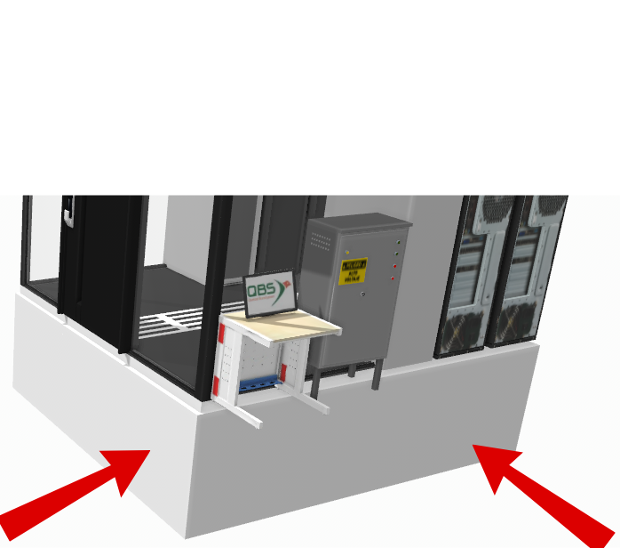

---

## Esbós de la sala de servidors

Característiques:

- **Quadre elèctric** abans de la sala principal
- **Ordinador de control** del CPD
- **Aire condicionat** de suport
- **SAIs** (1 per rack) per mantenir operativitat en cas de fallada elèctrica

**Dimensions de la sala:** 5m x 4m

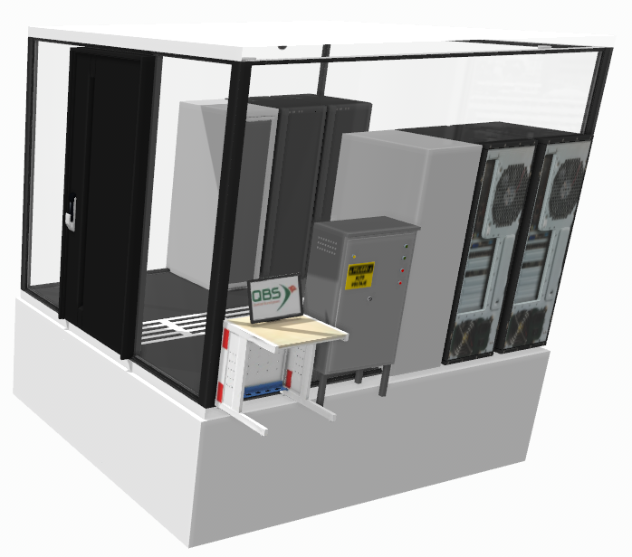
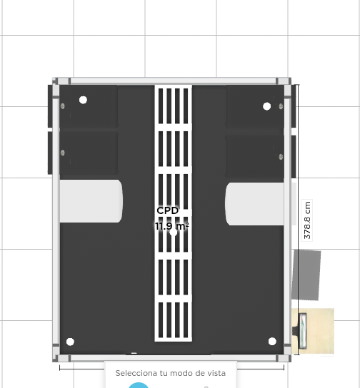

---

## Estructuració dels racks

Comptem amb **3 racks de 42U**, organitzats en una fila horitzontal:

- **Rack 1:** Servidors i sistemes de virtualització
- **Rack 2:** Emmagatzematge i còpies de seguretat
- **Rack 3:** Comunicacions i xarxa (switches, firewall, etc.)

Cada rack inclou:

- **PDU intel·ligents**
- **Etiquetatge i organització interna**

Aquesta estructura facilita el manteniment, millora l’eficiència energètica i permet escalar la infraestructura segons necessitats.

📷 **[Veure imatge dels racks](URL)**

# Infraestructura IT

Per desenvolupar aquesta proposta, s’han investigat les tendències actuals en hardware per a centres de dades, utilitzant fonts fiables com especificacions de fabricants (Dell, Cisco, Panduit) i estàndards de la indústria. S’han prioritzat components que equilibren rendiment, eficiència energètica i sostenibilitat, considerant les necessitats específiques d’Innovate Tech. La selecció s’ha centrat en hardware compatible amb un entorn híbrid (núvol i local) per maximitzar l’escalabilitat i minimitzar l’impacte ambiental.

## Servidor: Dell PowerEdge R670

**Especificacions tècniques:**
- **Processador:** 2x Intel Xeon Scalable de 4a generació (32 nuclis per CPU, 2.1 GHz)
- **Memòria RAM:** 256 GB DDR5, escalable fins a 8 TB
- **Emmagatzematge:** 4x SSD NVMe de 3.84 TB en RAID 10
- **Eficiencia energètica:** Dell Smart Cooling i OpenManage Power Manager

**Propòsit:**
- Serveis web i transcodificació de vídeo en temps real
- Suport per a àudio i compartició de dades

### Sostenibilitat:

#### ODS 7:
- **Fonts d'alimentació de categoria Titanium:** Eficiència >94%
- **OpenManage Power Manager:** Monitoratge i optimització del consum
- **Dell Smart Cooling:** Reducció de fins a un 20% del consum de refrigeració

#### ODS 12:
- **Disseny modular:** Facilita l’actualització sense substituir tot l’equip
- **Materials reciclables:** Programes com Dell Asset Recovery Services

#### ODS 13:
- **Materials i processos sostenibles:** Alumini reciclat redueix fins a un 95% d’emissions respecte alumini verge

**Justificació:**  
Els PowerEdge R760 són ideals per gestionar entre 8000 i 9500 connexions simultànies amb un rendiment alt, mantenint l’eficiència energètica i escalabilitat modular (ODS 9).

---

## Patch Panels: HYCONNECT HPP-94802F

**Especificacions tècniques:**
- **48 ports RJ45 Cat6** (fins a 10 Gbps)
- **Compatibilitat:** Cat6
- **Disseny modular** amb ports numerats

**Propòsit:**
- Organització de connexions de xarxa entre servidors, switches i dispositius auxiliars
- Suport per a streaming 2K de 8000-9500 connexions simultànies (48-57 Gbps)

### Sostenibilitat:

#### ODS 7:
- Component passiu, no consumeix energia

#### ODS 12:
- Disseny modular i materials reciclables (plàstics/metalls reutilitzables)

#### ODS 13:
- Menor extracció de recursos, disseny compacte per eficiència energètica

---

## Switches: Cisco Nexus 93600CD-GX (2 unitats)

**Especificacions tècniques:**
- **28 ports 100/400GbE QSFP-DD + 8 ports 10/25GbE SFP28**
- **Capacitat total:** 12.8 Tbps
- **Característiques:** VXLAN, EVPN, segmentació de xarxa, Cisco EnergyWise

**Propòsit:**
- Gestió del tràfic de 48-57 Gbps de 8000-9500 connexions simultànies
- Connexió amb núvols (AWS/Google Cloud)
- Latència <1 ms i alta fiabilitat

### Sostenibilitat:

#### ODS 7:
- Fonts d’alimentació d’alta eficiència (92%+)
- Cisco EnergyWise: Reducció fins a un 15% del consum en ports inactius

#### ODS 12:
- Disseny escalable per evitar substitucions
- Materials reciclables i programes de reciclatge

#### ODS 13:
- Fabricació amb menor petjada de carboni

🔗 **Enllaç oficial:**  
[Cisco Nexus 93600CD-GX Switch](https://www.cisco.com/site/us/en/products/networking/switches/nexus-9000-series-switches/index.html)

---

## Planells i diagrames

📷 **[Vista esquemàtica de la sala del CPD](https://i.imgur.com/EsquemaSalaCPD.jpg)**  
📷 **[Distribució de racks i cablejat](https://i.imgur.com/DistribucioRacks.jpg)**  
📷 **[Flux d'aire i refrigeració](https://i.imgur.com/FluxRefrigeracio.jpg)**  
📷 **[Connexió entre servidors i switches](https://i.imgur.com/ConnexionsSwitches.jpg)**  


# Infraestructura Elèctrica

## Sistemes d’Alimentació Redundant

### Doble font d’alimentació externa
- Connexió a **dues línies elèctriques independents** (proveïdor principal i secundari).
- Cada línia connectada a un **quadro elèctric independent** amb **interruptors automàtics** de protecció contra sobrecàrregues i curtcircuits.

### Generador elèctric d’emergència
- **Tipus:** Generador dièsel de **100 kVA**
- **Cobertura:** Servidors, climatització, il·luminació i sistemes de seguretat.
- **Temps d’engegada:** 10-15 segons després de la pèrdua de corrent.
- **Dipòsit:** Autonomia per a **24 hores**, amb **contracte de reposició ràpida**.
- **Ubicació:** Àrea externa ventilada, protegida contra incendis i amb accés restringit.

## Distribució elèctrica interna

- Sistema de distribució amb **busbars** (barres conductores).
- Quadres de distribució amb **circuits segregats**:
  - Servidors (racks)
  - Climatització
  - Sistemes auxiliars
- **Cablejat:** Coure amb aïllament ignífug.
- **Capacitat màxima:** 80 kW

### Redundància N+1
- Per a **tots els components crítics** (transformadors, quadres elèctrics, SAIs).
- **Exemple:** Si es necessiten 2 transformadors, s’instal·len 3.

---

## SAI (Sistema d’Alimentació Ininterrompuda)

### Capacitat i especificacions
- **SAIs modulars**, capacitat total: **80 kVA**
  - 60 kW per servidors
  - 20 kW per climatització i sistemes auxiliars
- **Tecnologia:** Doble conversió online
- **Eficiència energètica:** ≥95% (ODS 7)

### Nombre de bateries

- **Tipus:** 
  - Plom-àcid segellades (VRLA)
  - Bateries de liti (Li-ion)

#### Càlcul de la càrrega
- **Consum estimat:** 80 kW  
- **Temps d’autonomia requerit:** 15 minuts  
- **Energia necessària:**  
  `80 kW × (15/60) h = 20 kWh`

#### Supòsit de bateries
- **Bateria tipus:** 48V, 100 Ah → 4,8 kWh/bateria  
- **Nombre mínim:** `20 kWh ÷ 4.8 = 4.16` → **5 bateries (amb marge)**

#### Configuració
- **2 bancs de bateries en paral·lel (N+1)**:
  - **3 bateries per banc**
  - Permet manteniment sense interrupcions

---

## Components addicionals

- **Mòduls de bypass automàtic**
- **Sistema de monitoratge remot**:
  - Estat de càrrega
  - Temperatura
  - Cicles de vida
  - Alertes en temps real
- **Armaris de bateries**:
  - Ventilació
  - Protecció contra incendis (RIPCI)

---

## Temps de funcionament sense corrent

- **Objectiu:** 15 minuts per servidors i sistemes crítics
- **Escalabilitat:** Possibilitat d’ampliació a 30 minuts afegint més bancs

---

## Sostenibilitat

- Ús de **bateries reciclables** amb **certificació de baix impacte ambiental**
- Configuració del SAI en **mode ECO** en càrregues baixes
- **Gestió responsable del reciclatge** de bateries amb un proveïdor autoritzat


# Seguretat Física del CPD

## 1. Elements de Control d’Accés

Per garantir la seguretat del CPD, cal implementar un sistema robust de control d’accés que restringeixi l’entrada només a personal autoritzat.

### Portes de seguretat amb tancament electromagnètic
- Portes blindades amb **tancaments electromagnètics**.
- Resistents a intrusions i amb **protecció contra incendis** (classificació RF-60 o superior).

### Sistemes d’autenticació biomètrica i/o targetes RFID
- **Lectors d’empremtes dactilars** o **escàners d’iris**.
- **Targetes RFID** personalitzades amb codis únics.
- **Doble factor d’autenticació**: combinació de biometria i PIN o targeta.

### Registre d’accessos
- Sistema centralitzat que **enregistra hora, data i identitat** de cada accés o intent.
- Integració amb software de gestió per monitoratge en temps real.

### Sala de control adjacent
- Sala propera amb **personal de seguretat** per verificar autoritzacions.

### Mesures per dificultar la identificació
- **Absència de senyalització externa** sobre el CPD.
- Portes **sense identificadors visuals** i acabats discrets.

---

## 2. Videovigilància

### Càmeres IP d’alta resolució
- Resolució mínima **4K** amb visió nocturna.
- Ubicació: entrades, passadissos, racks i zones perimetrals.
- **Angle de visió de 360°** o càmeres **PTZ**.

### Enregistrament i emmagatzematge
- Gravació contínua **24/7**.
- Emmagatzematge en **servidor dedicat** amb **RAID 5**.
- **Retenció de dades:** 30 dies (complint RGPD).

### Monitoratge en temps real
- Connexió amb **sala de control** per supervisió directa.
- **Alertes automàtiques** en cas de moviment no autoritzat.

### Seguretat del sistema
- **Xifratge de transmissió** de vídeo.
- Accés restringit amb **autenticació de dos factors**.

---

## 3. Sistemes de Prevenció, Detecció i Extinció d’Incendis

### Prevenció
- **Materials ignífugs** per parets, terres i sostres (RF-120).
- **Cablejat ignífug**, ordenat en safates.
- **Control climàtic**:
  - Temperatura: 18–27°C
  - Humitat relativa: 40–60%

### Detecció
- **Sensors de fum i calor** òptics i tèrmics (sostre i sota terra tècnic).
- **Sistemes d’alarma** visuals i sonors connectats al panell central.
- **Monitoratge contínua** via sistema BMS.

### Extinció
- **Gas net**: FM-200 o Novec 1230 (segurs per equips i persones).
- **Extintors manuals** de CO₂ i pols ABC, revisats periòdicament.
- **Tancament automàtic** de portes cortafocs.

---

## 4. Vies d’Evacuació

### Rutes clarament senyalitzades
- **Senyals lluminosos i reflectants** visibles fins i tot amb fum.
- Mínim de **dues sortides independents**, accessibles en menys de 50 m.

### Portes d’emergència
- Amb **barres antipànic**, obertura cap a l’exterior.
- Connexió directa a **escales protegides o zones segures**.

### Il·luminació d’emergència
- **Llums LED** amb bateries independents.
- Autonomia mínima: **2 hores**.

### Simulacres i formació
- **Pla d’evacuació documentat**.
- **Simulacres periòdics**.
- **Cartells informatius** amb plànol de sortida.

---

## 5. Diagrames, Planells i Fotografies

### Planells

#### Plànol de la sala del CPD
- Distribució de:
  - Portes de seguretat
  - Càmeres de videovigilància
  - Sensors de fum/calor
  - Extintors
  - Vies d’evacuació
- Ubicació dels sistemes de control d’accés.
- Escala recomanada: **1:100**

#### Diagrama de flux de seguretat
- Esquema del procés d’accés:
  - Autenticació
  - Registre
  - Verificació
- Connexions entre sistemes i sala de control.

### Diagrames

#### Diagrama de videovigilància
- Xarxa de càmeres IP
- Servidor d’enregistrament
- Protocols de xifratge i flux de dades

#### Diagrama del sistema antiincendis
- Sensors
- Alarmes
- Dipòsits de gas net
- Connexió al panell central

### Fotografies
- Imatges (reals o simulades) de:
  - Portes de seguretat amb biometria
  - Càmeres instal·lades
  - Extintors i senyals d’evacuació


# Seguretat Lògica

## 1. Restricció d’Accés per Autorització

### Control d’accés electrònic
- Instal·lació de **lectors de targeta d’identificació**.
- Només el **personal autoritzat** disposarà de targeta.
- La **persona responsable de la seguretat** haurà d’habilitar la targeta.
- Possibilitat d’**autoritzacions temporals**, també requeriran aprovació explícita.

### Registre d’accés (logs)
- Registre automàtic de:
  - **Hora d’entrada/sortida**
  - **Identitat de la persona**
  - **Motiu de l’accés** (si és possible)
- **Integració** amb sistemes de **control horari** o de **presència**.

---

## 2. Firewalls

### Política per defecte
- **Bloqueig total** inicial: només es permetrà el tràfic explícitament autoritzat.

### Regles per tràfic entrant (extern cap al CPD)
- **HTTP/HTTPS (ports 80 i 443)**:
  - Permetre només connexions cap a **servidors que hostegen plataformes de streaming**.
  
- **Ports de Streaming (RTSP, RTP, etc.)**:
  - Permetre només connexions de **clients autoritzats** (per ex. RTSP 554).

- **Bases de dades**:
  - Permetre tràfic exclusivament entre les **aplicacions de streaming i els servidors de base de dades**:
    - MySQL (3306)
    - PostgreSQL (5432)

- **SSH**:
  - Permetre només a **usuaris de confiança**.

- **Altres serveis**:
  - Permetre només els ports estrictament **necessaris pels serveis futurs**.

---

## 3. Monitorització

### Eines utilitzades
- **Nagios** i **Wireshark** per a monitorització de:
  - Xarxa
  - Bases de dades
  - Web

### Funcionalitats
- Alertes de **caigudes de serveis**.
- Revisió de **logs i esdeveniments**.
- **Anàlisi de dades** i **identificació de tendències** per a millores contínues.

---

## 4. Còpies de Seguretat / Backups

### Estratègia de còpies
- **Còpia completa**:
  - Diumenges a les **23:00** (moment de menor activitat).
  
- **Còpies diferencials**:
  - La resta de dies laborables.

### Tipus d’emmagatzematge
- **Dos tipus diferents**:
  - Discs durs locals
  - Emmagatzematge al núvol

- **Còpia fora de lloc**:
  - Garanteix la **recuperació de dades** en cas de desastre físic al CPD.

---

## 5. RAID (Redundant Array of Independent Disks)

### Configuració recomanada: **RAID 5**

#### Avantatges
- **Alta disponibilitat i redundància**:
  - Mitjançant **paritat distribuïda**, es pot recuperar la informació si un disc falla.

- **Ús eficient de l’espai**:
  - A diferència de RAID 1, no es redueix la capacitat total a la meitat.

- **Bon rendiment de lectura**:
  - Lectura paral·lela gràcies a la distribució de dades entre discos.

- **Cost i escalabilitat**:
  - Bona relació **cost/benefici**.
  - Possibilitat d’**afegir discos** per ampliar la capacitat.

---
# Sostenibilitat

## Optimització del consum d’energia

- Ús d’**energies renovables** i contractació d’**energia verda certificada**.
- Programació de tasques intensives (ex: backups, replicacions) en horaris de **tarifa reduïda**.
- Integració d’**energia solar**.
- Optimització de la distribució elèctrica per evitar conversions innecessàries d’**AC-DC-AC**.
- Implementació de **PDU intel·ligents** per mesurar el consum per rack o dispositiu.
- Automatització de l’activació/desactivació de recursos segons la càrrega.
- Alarmes per detectar **sobreconsum**, ineficiències o calor excessiu.
- Apagat o posada en **mode estalvi** dels equips no essencials fora d’hores punta.
- Ús de servidors, switches i equips amb certificació **Energy Star** o equivalents.

## Ús d’energia verda pel CPD

- Contractació d’un pla d’energia **100% renovable** (solar, eòlica, hidroelèctrica, etc.).
- Empreses d’energia verda recomanades: [Holaluz - Energia verda](https://www.holaluz.com/energia-verde)
- Integració d’energia solar per autoconsum.

## Estalvi en longitud de cablejat

- Organització dels racks i servidors a prop dels **commutadors de xarxa (switches)** i dels quadres elèctrics.
- Ús de càmeres de videovigilància **inalàmbrica** en comptes de cablejades.
- Agrupació dels equips que necessiten connexió entre ells per reduir la necessitat de cables llargs.
- Ús, si és possible, de **racks de comunicacions centrals** per minimitzar la dispersió del cablejat.

## Sistemes de circulació d’aire que aprofitin condicions naturals

- Sistema de ventilació natural que aprofita l’aire exterior quan la temperatura i humitat són adequades.
- L’aire fresc entra filtrat per canals controlats i circula per la sala mitjançant un flux natural, amb suport de ventiladors eficients si cal.
- L’aire calent s’expulsa cap a l’exterior, reduint al mínim el consum d’energia en refrigeració.

## Parada d’equips de comunicacions quan no hi ha càrrega

- Els equips de xarxa i comunicacions es configuren per aturar-se automàticament o reduir l’activitat en absència de trànsit de dades.
- Inclou ports de xarxa, servidors virtualitzats i dispositius redundants, evitant consum innecessari en hores de baixa activitat.

## Equips de baix consum energètic

- Servidors, switches i sistemes d’emmagatzematge seleccionats per la seva eficiència energètica (etiquetes Energy Star o equivalents).
- Aquests equips ofereixen el mateix rendiment amb menor consum elèctric i generen menys calor, reduint la necessitat de refrigeració.
- 


# Pas a pas per a la implementació de servidors d'àudio i vídeo

Aquest document detalla els passos per implementar un servidor d'àudio (Icecast2), un servidor de streaming de vídeo (Nginx amb mòdul RTMP) i comprovacions d'amplada de banda (amb iperf3), basant-se exclusivament en les comandes i configuracions del document proporcionat.

# AUDIO

## Pàgina 1: Instal·lació de paquets per al servidor d'àudio

**Objectiu**: Preparar el sistema per al servidor d'àudio amb Icecast2 i eines relacionades.

**Passos**:
1. **Instal·lació de paquets**:
   ```bash
   sudo apt install icecast2 nginx libnginx-mod-rtmp ffmpeg iperf3 htop -y
   ```
   - **Descripció**: Instal·la `icecast2` (streaming d'àudio), `nginx` i `libnginx-mod-rtmp` (streaming de vídeo), `ffmpeg` (gestió multimèdia), `iperf3` (proves d'amplada de banda) i `htop` (monitorització). L'opció `-y` automatitza la instal·lació.
   - **Acció**: Executar la comanda en un sistema Ubuntu.

2. **Habilitació d'Icecast2**:
   ```bash
   sudo sed -i 's/ENABLE=false/ENABLE=true/' /etc/default/icecast2
   ```
   - **Descripció**: Modifica `/etc/default/icecast2` per habilitar l'inici automàtic d'Icecast2.
   - **Acció**: Executar la comanda per activar el servei.


## Pàgina 2: Configuració del servidor Icecast2

**Objectiu**: Configurar els paràmetres d'Icecast2 per a connexions d'àudio.

**Passos**:
1. **Edició de la configuració d'Icecast2**:
   ```xml
   <limits>
     <clients>100</clients>
     <sources>5</sources>
     <queue-size>524288</queue-size>
     <client-timeout>30</client-timeout>
     <header-timeout>15</header-timeout>
   </limits>
   ```
   - **Descripció**: Estableix 100 clients màxims, 5 fonts d'àudio, cua de 524288 bytes, temps d'espera de clients de 30 segons i de capçaleres de 15 segons a `/etc/icecast2/icecast.xml`.
   - **Acció**: Editar el fitxer amb un editor com `nano` i afegir/modificar la secció `<limits>`.

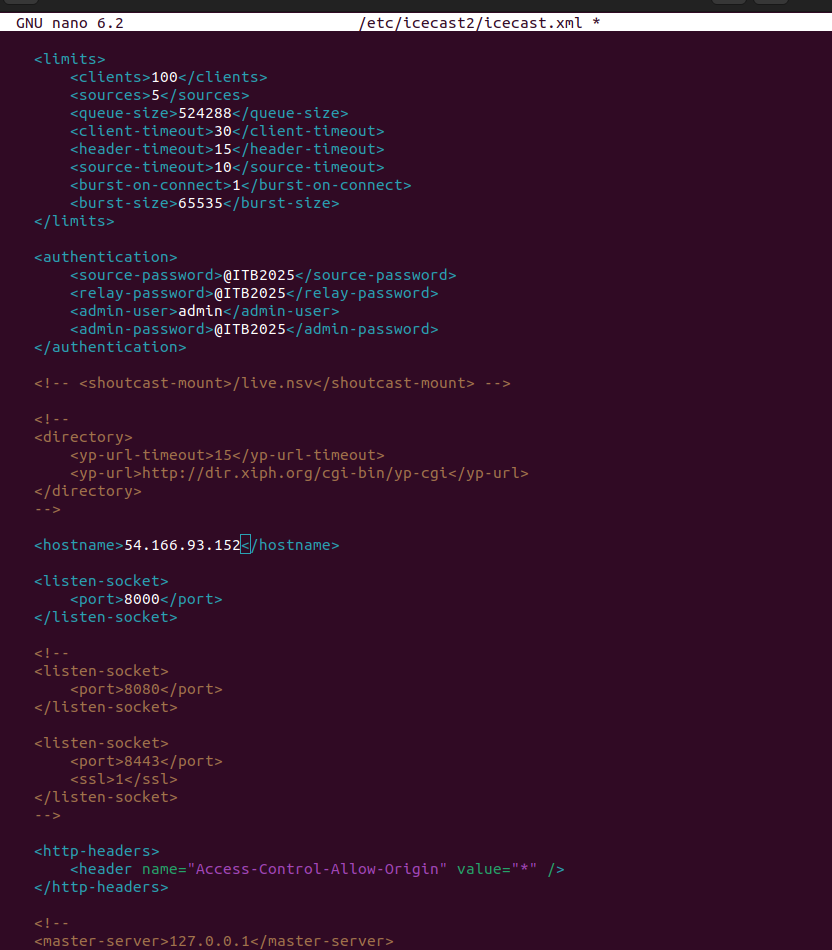

## Pàgina 3: Configuració del tallafocs i inici de DarkIce

**Objectiu**: Obrir ports per a Icecast2 i iniciar el streaming amb DarkIce.

**Passos**:
1. **Obertura de ports al tallafocs**:
   ```bash
   sudo ufw allow 8000/tcp
   sudo ufw allow 22/tcp
   ```
   - **Descripció**: Permet trànsit al port 8000/TCP (Icecast2) i 22/TCP (SSH) amb `ufw`.
   - **Acció**: Executar les comandes per actualitzar les regles del tallafocs.

2. **Inici de DarkIce**:
   ```bash
   sudo darkice
   ```
   - **Descripció**: Inicia DarkIce per enviar fluxos d'àudio a Icecast2 usant `/etc/darkice.cfg`.
   - **Acció**: Executar la comanda per iniciar el streaming.
   
## Inici i executar Icecast i l'audio

**Objectiu**: Executar Icecast i fer la comprovació que funciona l'audio

**Passos**:
1. **Execució de la comanda de transmissió**:
   
**La comanda reprodueix en temps real l'arxiu live.mp3 i l’envia com a streaming d’àudio MP3 a un servidor Icecast a través d'internet.**

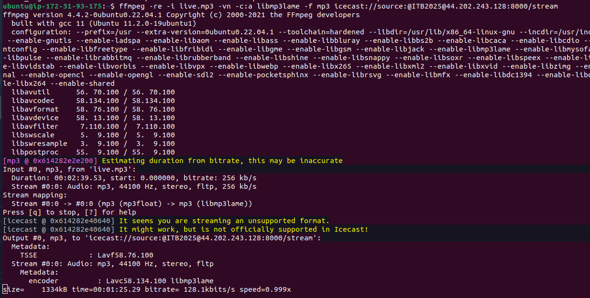

3. **Posar a la URL la ruta necessaria**:
   ```bash
   http://LA_IP_CORRESPONENT:8000
   ```
4. **Si hem fet tot bé, hauria de sortir la pagina d'Icecast**

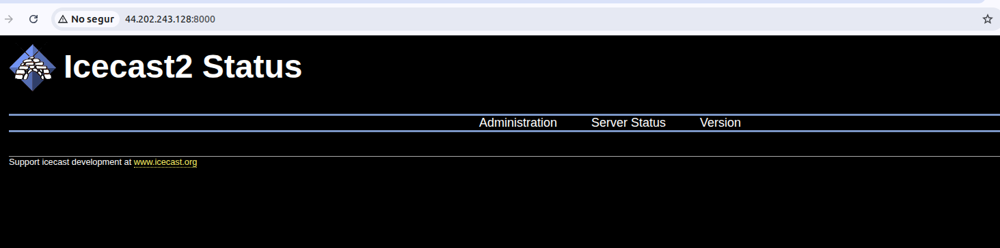

4. **Seguidament posem la mateixa URL, pero aquest cop afegint /stream després del :8000 per fer servir l'audio**

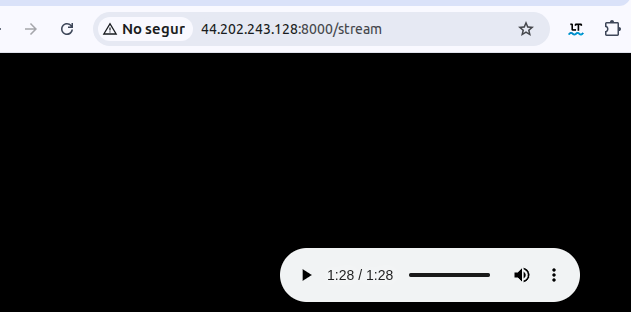


## Pàgina 4: Actualització del sistema

**Objectiu**: Actualitzar el sistema per assegurar la versió més recent dels paquets.

**Passos**:
1. **Actualització de paquets**:
   ```bash
   sudo apt update && sudo apt upgrade
   ```
   - **Descripció**: Actualitza la llista de paquets (`apt update`) i instal·la les versions més recents (`apt upgrade`) des dels repositoris d'Ubuntu.
   - **Acció**: Executar la comanda per mantenir el sistema actualitzat.

# VÍDEO

## Pàgina 5: Configuració del servidor de streaming de vídeo

**Objectiu**: Configurar Nginx per a streaming de vídeo en directe i sota demanda.

**Passos**:
1. **Creació del directori per a vídeos**:
   ```bash
   sudo mkdir -p /var/www/html/videos
   ```
   - **Descripció**: Crea el directori `/var/www/html/videos` per emmagatzemar vídeos sota demanda.
   - **Acció**: Executar la comanda per crear el directori.

2. **Assignació de permisos**:
   ```bash
   sudo chmod -R 755 /var/www/html/videos
   ```
   - **Descripció**: Assigna permisos 755 al directori `/var/www/html/videos`.
   - **Acció**: Executar la comanda per configurar els permisos.

3. **Configuració de Nginx RTMP**:
   ```nginx
   rtmp {
       server {
           listen 1935;
           chunk_size 4096;
           application live {
               live on;
               record off;
           }
           application vod {
               play /var/www/html/videos;
           }
       }
   }
   ```
   - **Descripció**: Configura Nginx per a streaming RTMP al port 1935, amb suport per a streaming en directe (`live`) i sota demanda (`vod`) des de `/var/www/html/videos`.
   - **Acció**: Afegir aquesta configuració al fitxer de Nginx i reiniciar el servei.
  
   
4. **Configuració de Nginx RTMP**:

**Objectiu**: Executar RTPM i fer la comprovació que funciona el video

**Passos**:
1. **Execució de la comanda de transmissió**:
   
**Aquesta comanda de ffmpeg serveix per enviar un vídeo MP4 com a stream en directe cap a un servidor RTMP.**

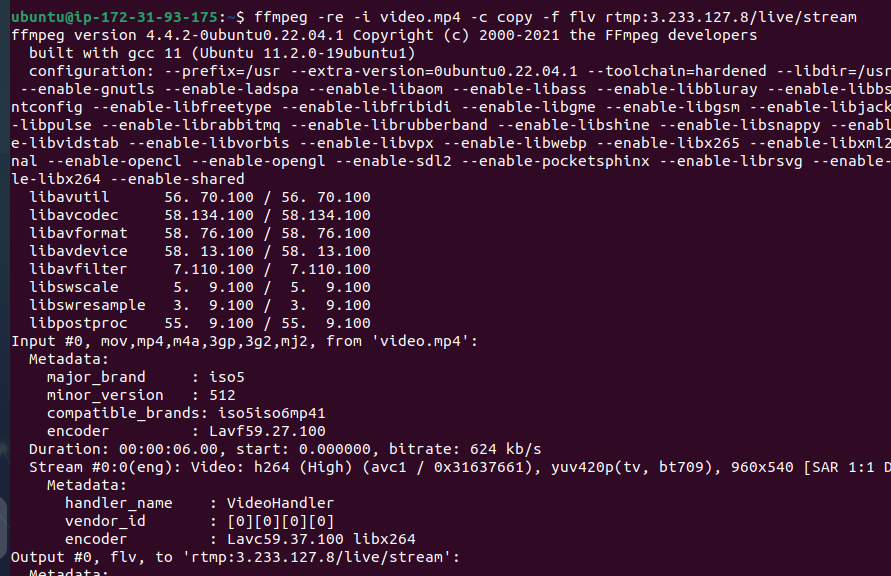

2. **Hem d'anar al reproductor multimedia VLC i clicar a obrir un flux de xarxa**

**Aquest pas serveix per reproduir en VLC un vídeo en directe emès per RTMP, hem de posar la URL per obrir el flux de xarxa**

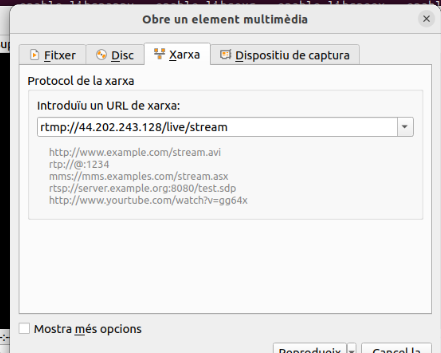

3. **Si ho hem fet tot bé, hauria d'aparèixer el video en questió, també es pot canviar l'ordre, primer obrir el flux de xarxa i després la comanda de transmissió.**

**Pot ser que haguem de clicar el botó de PLAY uns quants cops, ja que a vegades triga una mica**

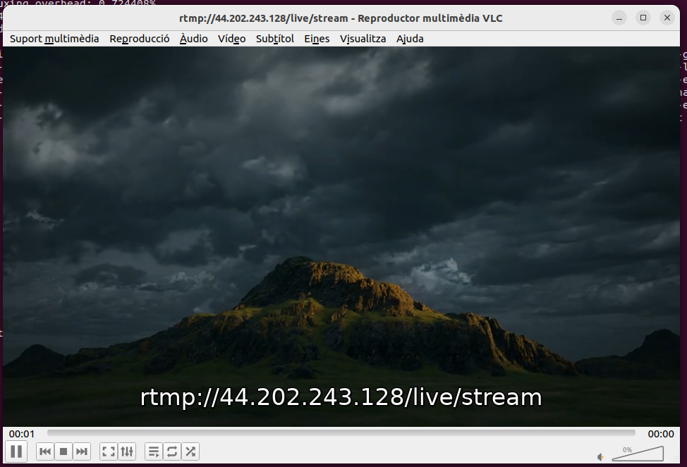


# COMPROVACIÓ D'AMPLE DE BANDA

## Pàgina 7: Instal·lació d'iperf3

**Objectiu**: Instal·lar iperf3 per a proves d'amplada de banda.

**Passos**:
1. **Instal·lació d'iperf3**:
   ```bash
   sudo apt update && sudo apt install -y iperf3
   ```
   - **Descripció**: Actualitza els repositoris i instal·la iperf3. L'output indica que iperf3 ja està a la versió més recent.
   - **Acció**: Executar la comanda per assegurar que iperf3 està instal·lat.

2. **Per assegurar que funcioni, hem de configurar els ports del security group de l'instància**


## Pàgina 8: Prova d'amplada de banda amb iperf3

**Objectiu**: Mesurar l'amplada de banda de la xarxa.

**Passos**:
1. **Prova amb iperf3 -s**:
   ```bash
   iperf3 -s
   ```
   - **Descripció**:Aquesta comanda inicia iperf3 en mode servidor, deixant la màquina a l’espera de connexions entrants d’un client iperf3.
     
   - **Acció**: Executar la comanda i analitzar els resultats per verificar la capacitat de la xarxa.

**Captura**:
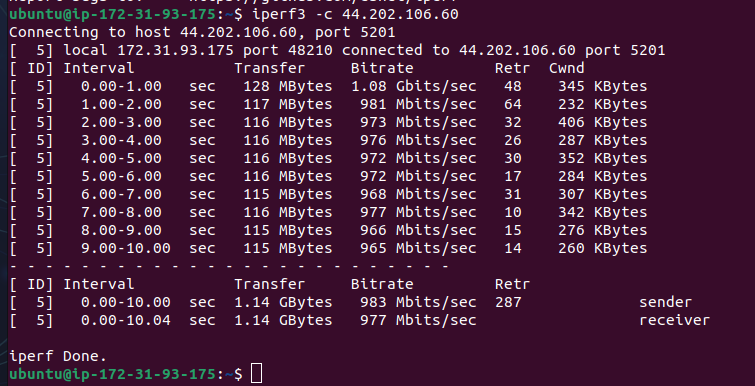

2. **Prova amb iperf3 -c**:
   ```bash
   iperf3 -c 44.220.106.60
   ```
   - **Descripció**: Executa iperf3 en mode client per connectar-se al servidor 44.202.106.60 (port 5201). Els resultats mostren una transferència de 1.14 GBytes a 977 Mbits/s de mitjana en 10.04 segons.
     
   - **Acció**: Executar la comanda i analitzar els resultats per verificar la capacitat de la xarxa.

**Captura**:
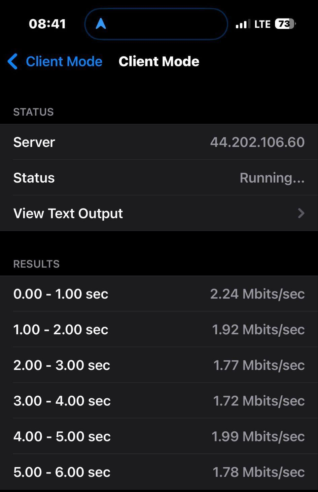


<!-- Parte server Diego -->


# **EC21**

## **SERVEI WEB**

### **Instal·lació**

Instal·lar amb:

```bash
sudo apt install nginx
```

[Ver captura de instalación](ruta/a/imagen1.png)

---

### **Configuració**

Editem l’arxiu de configuració perquè sàpiga on està l'HTML i per on escoltarà.  
També activem el site i ja tindríem operativa la pàgina web.

[Ver captura configuración 1](ruta/a/imagen2.png)  
[Ver captura configuración 2](ruta/a/imagen3.png)  
[Ver captura configuración 3](ruta/a/imagen4.png)

---

### **Comprovació**

[Ver comprovació web](ruta/a/imagen5.png)

---

## **SERVEI FTP**

Instal·lem el servei FTP:

```bash
sudo apt install proftpd -y
```
Al directori li donem només permisos de lectura ja que l'ftp només serà per llegir fitxers d’anuncis de l’empresa, per descarregar coses que publiquem o descarregar arxius importants
[Ver instal·lació FTP](ruta/a/imagen6.png)  
[Ver configuració FTP](ruta/a/imagen7.png)  
[Ver usuaris FTP](ruta/a/imagen8.png)  
[Ver configuració usuaris](ruta/a/imagen9.png)  
[Ver permisos FTP](ruta/a/imagen10.png)  
[Ver exemple d'ús](ruta/a/imagen11.png)  
[Ver comprovació FTP](ruta/a/imagen12.png)

---

## **SERVEI SAMBA**
Com a l’ftp no poden pujar coses ni fer canvis, tenim el samba que és pels usuaris tinguin un “núvol”.

Per instal·lar:

```bash
sudo apt install samba -y
```
Crearem una carpeta on engabiarem als usuaris per només poder tenir accés a aquell directori i subdirectori i a l'arxiu indiquem que directori

[Ver instal·lació Samba](ruta/a/imagen13.png)  
[Ver configuració carpeta](ruta/a/imagen14.png)  
[Ver arxiu configuració](ruta/a/imagen15.png)  
[Ver comprovació samba](ruta/a/imagen16.png)

---

## **EXTRA: CONTROL DE CANVIS PER DISCORD**

### **Instal·lació de dependències**

[Ver dependències](ruta/a/imagen17.png)  
[Ver script servei](ruta/a/imagen18.png)

### **Configuració i comprovació**
Configurem un script per que escolti el que esta pasant al samba indicant la carpeta, i el fem un servei perquè s’executi constantment.
[Ver script escoltant](ruta/a/imagen19.png)  
[Ver execució final](ruta/a/imagen20.png)  
[Ver comprovació canvis](ruta/a/imagen21.png)  
[Ver alerta Discord](ruta/a/imagen22.png)
