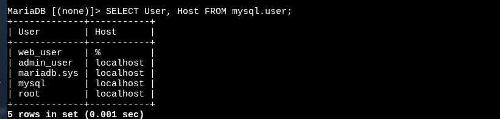

\
 \ \</div\>

**Pas 1: Connexió al servidor MariaDB/MySQL**

mysql \-h 172.31.42.193 \-u web\_user \-p

---

 \
 \ \</div\>

**Pas 2: Crear la base de dades i seleccionar-la**

CREATE DATABASE empresa;  
 USE empresa;

---

 \
 \ \</div\>

**Pas 3: Crear la taula Departament**

CREATE TABLE Departament (  
 Codi INT PRIMARY KEY,  
 Nom VARCHAR(50) NOT NULL,  
 Telefon VARCHAR(15)  
 );

---

 \
 \ \</div\>

**Pas 3: Crear la taula Grup\_Nivell**

CREATE TABLE Grup\_Nivell (  
 Codi INT PRIMARY KEY,  
 Salari\_Total DECIMAL(10,2) NOT NULL,  
 Periode\_Prova INT,  
 Dies\_Vacances INT  
 );

---

 \
 \ \</div\>

**Pas 3: Crear la taula Empleat amb claus foranes**

CREATE TABLE Empleat (  
 DNI VARCHAR(9) PRIMARY KEY,  
 Nom VARCHAR(50) NOT NULL,  
 Cognoms VARCHAR(100) NOT NULL,  
 Adreca VARCHAR(100),  
 Telefon VARCHAR(15),  
 Codi\_Departament INT,  
 Codi\_Grup\_Nivell INT,  
 FOREIGN KEY (Codi\_Departament) REFERENCES Departament(Codi),  
 FOREIGN KEY (Codi\_Grup\_Nivell) REFERENCES Grup\_Nivell(Codi)  
 );

---

 \
 \ \</div\>

**Pas 4: Inserir dades a la taula Departament**

INSERT INTO Departament (Codi, Nom, Telefon) VALUES  
 (1, 'Recursos Humans', '934123456'),  
 (2, 'Informàtica', '934123457'),  
 (3, 'Màrqueting', '934123458');

---

 \
 \ \</div\>

**Pas 4: Inserir dades a la taula Grup\_Nivell**

INSERT INTO Grup\_Nivell (Codi, Salari\_Total, Periode\_Prova, Dies\_Vacances) VALUES  
 (1, 30000.00, 90, 30),  
 (2, 45000.00, 60, 25),  
 (3, 60000.00, 30, 20);

---

 \
 \ \</div\>

**Pas 4: Inserir dades a la taula Empleat**

INSERT INTO Empleat (DNI, Nom, Cognoms, Adreca, Telefon, Codi\_Departament, Codi\_Grup\_Nivell) VALUES  
 ('12345678A', 'Joan', 'García Pérez', 'Carrer Major 1, Barcelona', '600123456', 1, 1),  
 ('87654321B', 'Maria', 'López Martínez', 'Avinguda Diagonal 2, Barcelona', '600123457', 2, 2),  
 ('45678912C', 'Pere', 'Sánchez Gómez', 'Plaça Catalunya 3, Barcelona', '600123458', 3, 3);

---

 \
 \ \</div\>

**Pas 5: Comprovació dels departaments**

SELECT \* FROM Departament;

---

 \
 \ \</div\>

**Pas 5: Comprovació dels grups-nivell**

SELECT \* FROM Grup\_Nivell;

---

 \
 \ \</div\>

**Pas 5: Consultar empleats amb departaments i salaris**

SELECT e.DNI, e.Nom, e.Cognoms, d.Nom AS Departament, g.Salari\_Total  
 FROM Empleat e  
 JOIN Departament d ON e.Codi\_Departament \= d.Codi  
 JOIN Grup\_Nivell g ON e.Codi\_Grup\_Nivell \= g.Codi;

---

 \
 \ \</div\>

**Pas 6: Fer còpia de seguretat de la base de dades**

mysqldump \-h 172.31.42.193 \-u web\_user \-p empresa \> empresa\_backup.sql

---

 \
 \ \</div\>

**Pas 7: Restaurar la base de dades (si cal)**

mysql \-h 172.31.42.193 \-u web\_user \-p empresa \< empresa\_backup.sql

---

 \
 \ \</div\>

**Pas 8 (opcional): Consultes addicionals per verificació**

Altres consultes SQL útils per comprovacions més específiques.

---

 \
 \ \</div\>

**Consulta filtrada: Empleats del departament 2**

SELECT Nom, Cognoms FROM Empleat WHERE Codi\_Departament \= 2;

---

 \
 \ \</div\>

**Consulta filtrada: Empleats amb salari \> 40000**

SELECT Nom, Cognoms FROM Empleat  
 JOIN Grup\_Nivell ON Empleat.Codi\_Grup\_Nivell \= Grup\_Nivell.Codi  
 WHERE Salari\_Total \> 40000;

